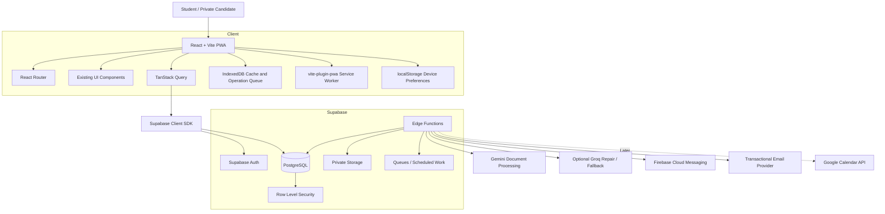
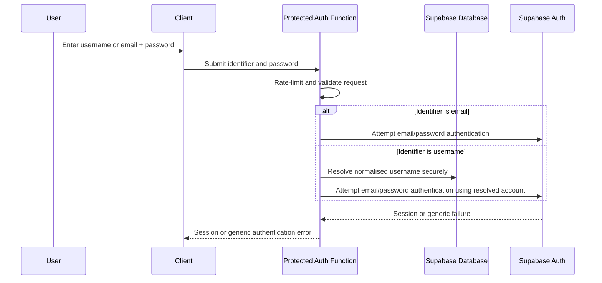
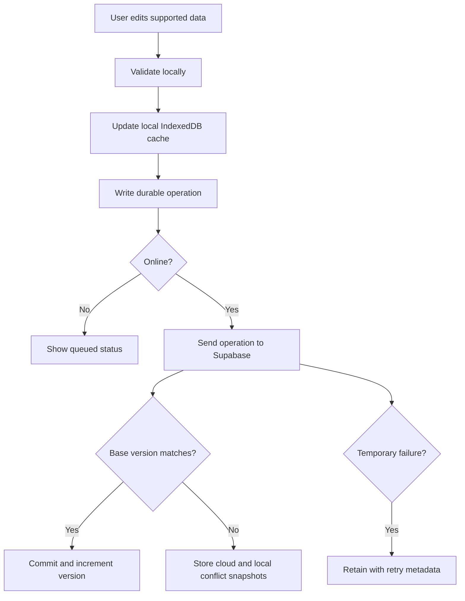
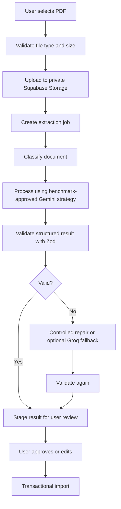

# Study Buddy Hub — Stage 3 Architecture and Implementation Plan

**Document status:** Draft 3 — core architecture approved; detailed Stage 3 specifications pending  
**SDLC stage:** Stage 3 — Architecture and Implementation Planning  
**Product scope source:** `docs/STUDY_BUDDY_HUB_STAGE_2_REQUIREMENTS_SCOPE.md`  
**Repository evidence source:** `docs/STUDY_BUDDY_HUB_STAGE_3_REPOSITORY_ARCHITECTURE_AUDIT.md`  
**Prior planning source:** `docs/STUDY_BUDDY_HUB_REVIVAL_PLAN.md`  
**Primary architectural direction:** Incremental cloud migration with no full frontend rewrite

---

## 1. Purpose

Stage 3 converts the approved Stage 2 product requirements into a buildable, testable and reversible technical architecture.

This document integrates:

- the approved Stage 2 product and scope decisions;
- the project owner's Stage 3 decisions;
- the verified repository architecture audit;
- the current implementation constraints;
- the proposed production architecture;
- the migration and implementation sequence;
- the technical decisions that remain open.

This is an architecture document, not an instruction to implement all phases immediately.

Implementation begins only after the architecture required for the relevant phase has been reviewed and approved.

---

## 2. Stage 3 Executive Decision

### 2.1 Architecture verdict

Study Buddy Hub is highly feasible for incremental cloud migration.

A full frontend rewrite is neither necessary nor approved.

The existing React, TypeScript, Vite, React Router, Tailwind CSS, shadcn/ui, Radix UI, Recharts, Zod and PWA foundations will be retained.

The migration will primarily replace and extend:

- browser-only persistence;
- the monolithic `useAppState` data flow;
- direct `localStorage` access;
- the incomplete offline queue;
- the duplicate exam-component models;
- direct client-side AI requests;
- local-only notification scheduling;
- missing authentication and user ownership;
- missing CI, monitoring and cloud security controls.

Selected UI components will still require incremental changes for:

- authentication;
- loading;
- errors;
- offline status;
- queued changes;
- conflict handling;
- account migration;
- permission prompts;
- cloud-backed empty states.

### 2.2 Verified repository facts

The Stage 3 repository audit confirms:

1. React 18, TypeScript 5.8 and Vite 5 are suitable for retention.
2. TanStack Query is installed and provides an existing migration path for server state.
3. The application currently has no authentication or backend database.
4. User data is fragmented across 17 `localStorage` keys.
5. No active IndexedDB application-data store currently exists.
6. `src/lib/storage.ts` is a 746-line persistence and import/export facade.
7. `src/hooks/useAppState.ts` is the central local-state silo.
8. The current offline queue supports only limited syllabus status and note changes and is a stub.
9. Two incompatible exam-component models exist.
10. `ImportDialog.tsx` is the active PDF/AI import interface.
11. `SyllabusUpload.tsx` is currently unused.
12. The current AI key is exposed in client-side code.
13. The current AI prompt silently truncates PDF text after 12,000 characters.
14. There is no CI workflow.
15. The build succeeds with two CSS warnings.
16. Type checking succeeds with strict mode disabled.
17. Lint succeeds with 19 warnings.
18. The test suite contains 94 tests, with six parser-test mismatches.
19. `package-lock.json` is canonical.
20. `bun.lock` and `bun.lockb` are unreferenced and may be removed during Phase 0.

---

## 3. Approved Project-Owner Architecture Decisions

The following decisions are approved and no longer require reconsideration during ordinary Stage 3 planning.

### 3.1 Authentication experience

Password-based users must be able to sign in using:

- their unique username; or
- their registered email address.

Alternative sign-in providers must include:

- Google;
- Microsoft;
- Apple.

Email remains required for:

- verification;
- account recovery;
- security communication.

Username is both:

- a unique Study Buddy Hub profile identity; and
- an accepted password-login identifier.

### 3.2 Protected backend

Supabase Edge Functions are the default protected backend environment.

Vercel Functions may be used only when a verified requirement makes them technically preferable.

### 3.3 Offline storage

IndexedDB will be used for:

- supported cloud-data cache;
- pending offline operations;
- conflict snapshots;
- recoverable drafts;
- migration checkpoints.

`localStorage` will remain only for:

- small device preferences;
- existing legacy data before migration;
- migration detection;
- non-sensitive UI state.

### 3.4 Uploaded syllabus visibility

User-uploaded and AI-extracted syllabus content is private by default.

It must not automatically modify or publish to the shared official syllabus catalogue.

### 3.5 First cloud milestone

The first cloud milestone must include:

- authentication;
- profile and onboarding;
- subjects;
- syllabus progress;
- syllabus notes;
- exam components;
- past-paper attempts;
- essential calculations based on that data.

The milestone will be implemented through smaller technical slices rather than one large deployment.

### 3.6 Notification order

The private-beta notification foundation will be implemented before advanced exam, deadline or calendar reminder automation.

The foundation includes:

- in-app notification history;
- user preferences;
- FCM device registration;
- secure push delivery;
- failure logging;
- token revocation;
- test notifications.

### 3.7 Mailbox integration boundary

Direct mailbox integration is outside Web v1.

Study Buddy Hub will not initially:

- read Gmail, Outlook or iCloud Mail;
- create drafts in those services;
- send mail from a user's personal mailbox;
- inspect or modify mailbox content.

Provider-agnostic transactional email remains supported for verified addresses from any provider.

---

## 4. Architecture Goals and Constraints

The architecture must:

1. preserve existing product value;
2. avoid a full frontend rewrite;
3. establish Supabase as the authoritative cloud data platform;
4. protect each user's private records with Row Level Security;
5. support 1–7 active subjects;
6. preserve shared academic metadata separately from private progress;
7. provide safe legacy-data migration;
8. support approved offline syllabus and past-paper workflows;
9. prevent silent cross-device overwrites;
10. protect AI, FCM, email and OAuth credentials;
11. maintain a free-tier-first and cost-controlled private beta;
12. keep FCM, Google Calendar and email as independent adapters;
13. support future expansion without introducing a second production database;
14. allow rollback at each implementation phase;
15. require automated verification before cloud-backed production changes.

---

## 5. Target System Architecture

### 5.1 High-level architecture



### 5.2 Platform roles

| Platform or technology | Approved responsibility |
|---|---|
| React/Vite application | User interface, validation, client interaction and offline coordination |
| React Router | Application navigation |
| TanStack Query | Cloud server-state fetching, mutations, retries and cache coordination |
| IndexedDB | Durable offline cache, queued operations, conflicts and drafts |
| localStorage | Device preferences and temporary legacy migration source |
| Vercel | Frontend and PWA hosting |
| Supabase Auth | Password accounts and Google, Microsoft and Apple sign-in |
| Supabase PostgreSQL | Authoritative relational product data |
| Supabase Row Level Security | User ownership enforcement |
| Supabase Storage | Private uploaded documents and generated export artefacts where appropriate |
| Supabase Edge Functions | Protected AI, username-login bridge, migration, export and notification operations |
| Supabase Queues/Cron | Suitable asynchronous or scheduled work after technical verification |
| Gemini | Provisional primary syllabus-document processor |
| Zod | Structured result validation |
| Groq | Optional repair, lightweight generation or compatible fallback where benchmarking proves value |
| Firebase Cloud Messaging | Push delivery only |
| Email provider | Application-generated transactional and reminder email |
| Google Calendar API | Later optional event synchronisation |
| Gmail/Outlook/iCloud mailbox APIs | Outside Web v1 |

### 5.3 Mandatory boundaries

- Supabase is the only authoritative production database.
- Firestore is not used.
- Firebase Authentication is not used.
- Firebase Storage is not used.
- FCM does not store authoritative notification history.
- AI provider keys never enter the browser bundle.
- Google sign-in does not automatically grant Calendar or mailbox permissions.
- Local browser storage is not the final account authority after migration.
- Shared syllabus catalogue records remain separate from private user progress.
- External integration failure must not corrupt the original Study Buddy Hub record.

---

## 6. Frontend Migration Architecture

### 6.1 Retained frontend

The existing frontend will be retained and migrated gradually.

The following remain approved:

- React 18;
- TypeScript;
- Vite;
- React Router;
- Tailwind CSS;
- shadcn/ui and Radix UI;
- Lucide;
- Recharts;
- Zod;
- TanStack Query;
- `vite-plugin-pwa`.

### 6.2 Proposed source boundaries

The exact folder layout may adapt to the repository, but responsibilities must be separated.

```text
src/
├── app/
│   ├── providers/
│   ├── routing/
│   └── startup/
├── features/
│   ├── auth/
│   ├── profile/
│   ├── subjects/
│   ├── syllabus/
│   ├── papers/
│   ├── analytics/
│   ├── ai/
│   ├── notifications/
│   ├── migration/
│   └── settings/
├── domain/
│   ├── types/
│   ├── schemas/
│   └── rules/
├── data/
│   ├── repositories/
│   ├── queries/
│   ├── mutations/
│   ├── offline/
│   └── migration/
├── integrations/
│   ├── supabase/
│   ├── fcm/
│   └── pwa/
├── components/
└── legacy/
```

### 6.3 Repository pattern

Components should not communicate directly with `localStorage`, Supabase tables or provider APIs.

Proposed flow:

```text
UI component
→ feature hook
→ repository interface
→ cloud repository or temporary legacy adapter
→ Supabase / IndexedDB / legacy localStorage
```

Example interfaces:

```typescript
interface SubjectRepository {
  list(): Promise<Subject[]>;
  create(input: CreateSubjectInput): Promise<Subject>;
  update(id: string, input: UpdateSubjectInput): Promise<Subject>;
}

interface PaperAttemptRepository {
  listBySubject(subjectId: string): Promise<PaperAttempt[]>;
  create(input: CreatePaperAttemptInput): Promise<PaperAttempt>;
  update(id: string, input: UpdatePaperAttemptInput): Promise<PaperAttempt>;
}
```

### 6.4 Gradual `storage.ts` migration

`storage.ts` must not be deleted in one large change.

Migration approach:

1. identify each active caller;
2. add repository interfaces;
3. wrap existing local functions in legacy repositories;
4. migrate one feature to cloud repositories;
5. keep a feature flag or controlled adapter fallback;
6. verify behaviour;
7. remove only the migrated legacy path;
8. repeat by domain.

### 6.5 TanStack Query responsibilities

TanStack Query becomes responsible for:

- cloud reads;
- mutation status;
- invalidation;
- retries;
- optimistic updates;
- reconnect refresh;
- cache freshness;
- cloud error state.

It is not by itself the durable offline database.

### 6.6 UI integration requirements

Selected UI areas must gain:

- authentication loading state;
- first-load cloud skeletons;
- retryable error states;
- offline badge;
- queued-change indicator;
- conflict notification;
- migration progress;
- extraction-job progress;
- permission explanations;
- account and session states.

---

## 7. Authentication and Identity Architecture

### 7.1 Account methods

Supported methods:

1. username or email + password;
2. Google;
3. Microsoft;
4. Apple.

### 7.2 Username requirements

Usernames must be:

- unique;
- case-insensitively unique;
- normalised;
- validated against allowed characters and length;
- checked against reserved names;
- safe for display;
- change-controlled.

The exact username policy will be included in the authentication specification.

### 7.3 Username-or-email password login flow

Supabase's standard password flow is email based. Username login therefore requires a protected authentication bridge.

Proposed logical flow:



Required controls:

- rate limiting;
- generic error messages;
- no public username-to-email lookup;
- no account-existence leakage;
- audit logging without passwords;
- password never persisted by the bridge;
- HTTPS only;
- bot and abuse controls where needed;
- recovery through verified email;
- secure account-linking rules.

This authentication bridge requires a focused technical spike before implementation.

### 7.4 Profiles

A `profiles` record is created or completed after successful authentication.

Proposed profile fields:

- `user_id`;
- `username`;
- `display_name`;
- `onboarding_status`;
- `created_at`;
- `updated_at`.

### 7.5 Social account linking

The architecture must avoid duplicate Study Buddy Hub accounts when the same person uses:

- email/password;
- Google;
- Microsoft;
- Apple.

Account-linking behaviour must be tested before public beta.

### 7.6 Session behaviour

The client must:

- restore valid sessions;
- refresh tokens;
- handle expiration;
- protect private routes;
- clear private caches on sign-out;
- preserve device-only appearance settings;
- never expose service-role credentials.

---

## 8. Data Architecture

### 8.1 Data categories

Study Buddy Hub data is divided into:

1. shared academic catalogue data;
2. private user-owned data;
3. staged import and AI data;
4. notification and integration data;
5. device-local data.

### 8.2 Shared catalogue domain

Proposed entities:

- `exam_boards`;
- `qualifications`;
- `catalogue_subjects`;
- `syllabuses`;
- `syllabus_versions`;
- `syllabus_nodes`;
- `syllabus_components`.

Ordinary users can read approved active catalogue records.

Ordinary users cannot directly publish or modify official catalogue records.

### 8.3 Private user domain

Proposed entities:

- `profiles`;
- `user_subjects`;
- `custom_subjects`;
- `custom_syllabus_nodes`;
- `user_syllabus_progress`;
- `syllabus_notes`;
- `custom_components`;
- `paper_attempts`;
- `weekly_reflections`;
- `activity_events`;
- `user_milestones`;
- `chapter_deadlines`;
- `calendar_events`;
- `user_preferences`.

### 8.4 Recommended component database structure

**Recommended architecture:** separate shared and private component tables.

```text
syllabus_components
→ official shared component definitions

custom_components
→ private user-created component definitions

ExamComponent
→ unified application/domain view
```

Advantages:

- clearer RLS;
- clearer catalogue ownership;
- safer deletion behaviour;
- simpler uniqueness rules;
- less risk of ordinary users modifying global records;
- easier moderation and future catalogue administration.

This recommendation is approved by the project owner. The schema specification must use separate shared `syllabus_components` and private `custom_components` tables while exposing one unified `ExamComponent` application model.

### 8.5 Unified component domain model

The application should expose one canonical domain model regardless of database source.

Proposed fields:

- `id`;
- `sourceType`;
- `subjectId`;
- `syllabusVersionId`;
- `name`;
- `paperCode`;
- `durationMinutes`;
- `totalMarks`;
- `weightingPercent`;
- `displayOrder`;
- `createdAt`;
- `updatedAt`.

The exact optionality and constraints will be defined in the schema specification.

### 8.6 Common database conventions

Persistent cloud records should use:

- UUID primary keys;
- `created_at`;
- `updated_at`;
- foreign keys;
- check constraints;
- uniqueness constraints;
- appropriate indexes;
- version markers for synchronised mutable data.

Private records include `user_id`.

Mutable offline-supported records include a version field.

### 8.7 Soft deletion

Soft deletion or tombstones should be used where required for:

- offline synchronisation;
- conflict safety;
- recovery;
- cross-device propagation.

Hard deletion occurs later according to retention and account-deletion rules.

---

## 9. Row Level Security and Authorization

### 9.1 Default private-data rule

A signed-in user can access only records owned by their `auth.uid()`.

### 9.2 Policy requirements

Private tables require explicit tested policies for:

- `SELECT`;
- `INSERT`;
- `UPDATE`;
- `DELETE`.

Policies must use:

- `USING` where appropriate;
- `WITH CHECK` where appropriate.

### 9.3 Shared catalogue policies

Authenticated users may read approved shared catalogue records.

Ordinary users may not directly:

- insert official syllabus versions;
- update shared syllabus nodes;
- delete shared components;
- publish private extracted material.

### 9.4 Service operations

Privileged operations are limited to trusted backend functions for:

- username login resolution;
- AI extraction;
- approved import commit;
- export generation;
- account deletion;
- notification dispatch;
- scheduled jobs;
- OAuth callbacks;
- future catalogue administration.

### 9.5 RLS verification matrix

Every private table must be tested for:

- owner select allowed;
- owner insert allowed;
- owner update allowed;
- permitted owner delete;
- non-owner select denied;
- non-owner mutation denied;
- unauthenticated access denied;
- trusted function behaviour verified.

---

## 10. Offline Cache and Synchronisation Architecture

### 10.1 Current state

The current application:

- stores user data in `localStorage`;
- can access that local data without a network connection once the app shell is available;
- uses a service worker for static application assets;
- has no active IndexedDB application-data store;
- contains a limited `localStorage` sync-queue stub.

### 10.2 Future offline-supported data

Initial cached access:

- selected subjects;
- syllabus structure;
- syllabus progress;
- syllabus notes;
- paper components;
- past-paper attempts;
- essential locally derived analytics.

Initial offline writes:

- confidence changes;
- syllabus-note changes;
- creating paper attempts;
- editing paper attempts;
- selected recoverable drafts.

### 10.3 Durable operation record

Each pending operation must contain:

- `operation_id`;
- `user_id`;
- `entity_type`;
- `entity_id`;
- `operation_type`;
- `payload`;
- `base_version`;
- `created_at`;
- `attempt_count`;
- `status`;
- `last_error`;
- `idempotency_key`.

### 10.4 Synchronisation process



### 10.5 Conflict rules

The client sends `base_version`.

The server accepts an update only when the cloud record still matches that base version.

On mismatch:

- the cloud record is not overwritten;
- the pending local operation is retained;
- both versions are stored;
- the user receives a conflict state.

Resolution choices:

- keep cloud;
- reapply local;
- merge supported fields.

Notes may support manual or field-aware merging.

Confidence values normally require one final selected value.

### 10.6 Atomic enforcement

Version comparison and update must occur atomically in PostgreSQL.

Client timestamps alone are insufficient.

### 10.7 IndexedDB abstraction decision

The exact IndexedDB abstraction remains an engineering decision.

Candidates may include:

- a small direct wrapper;
- `idb`;
- Dexie.

The selection must consider:

- TypeScript support;
- migrations;
- bundle impact;
- transaction reliability;
- testability;
- TanStack Query integration.

---

## 11. Legacy Local-Data Migration

### 11.1 Verified source inventory

The audit identified 17 `localStorage` keys:

#### Primary application keys

- `study-tracker-data`;
- `study-tracker-components`;
- `study-tracker-subject-components`;
- `study-tracker-chapter-planning`;
- `study-tracker-streak`;
- `study-tracker-milestones`;
- `study-tracker-sync-queue`;
- `study-tracker-reminder-settings`;
- `study-tracker-weighting`;
- `study-tracker-exam-schedule`;
- `study-tracker-reflections`;
- `study-tracker-extraction-changelog`.

#### Device/UI keys

- `chapter-completion-celebrated`;
- `subject-theme-overrides`;
- `theme`;
- `accessibility-settings`;
- `vite-ui-theme`.

### 11.2 Migration principles

- migration is offered after authentication;
- a local recovery export is created first;
- the user sees a preview;
- invalid records are isolated;
- duplicate imports are prevented;
- no local source data is deleted before verification;
- migration is repeat-safe;
- destination counts and checks are verified;
- successful cloud data becomes authoritative;
- selected local data becomes cache-only.

### 11.3 Migration workflow

```text
Detect legacy data
→ create recovery copy
→ read known keys
→ validate and transform
→ display preview
→ user confirms
→ create migration_run
→ upload in controlled batches
→ verify destination
→ mark complete
→ retain recovery copy until cleanup approval
```

### 11.4 Idempotency

Migration must use:

- `migration_run_id`;
- source-data hash;
- stable mapped identifiers where possible;
- import ledger;
- uniqueness constraints;
- safe repeat behaviour.

### 11.5 Proposed destination map

| Current source | Proposed destination |
|---|---|
| subjects in `study-tracker-data` | `user_subjects` / `custom_subjects` |
| syllabus bullets | shared-node mappings or `custom_syllabus_nodes` |
| confidence values | `user_syllabus_progress` |
| bullet comments | `syllabus_notes` |
| past papers | `paper_attempts` |
| custom components | `custom_components` |
| shared/default components | `syllabus_components` mappings |
| reflections | `weekly_reflections` |
| streak activity | `activity_events` and derived streak |
| milestones | `user_milestones` |
| reminder settings | `notification_preferences` |
| exam schedule | `calendar_events` or future exam-event table |
| chapter planning | `chapter_deadlines` |
| extraction changelog | `ai_extraction_jobs` / audit metadata |
| theme/accessibility | device-local or optional synced preferences |
| sync queue | not migrated as authoritative data; reconcile safely |

---

## 12. Past Papers and Analytics Architecture

### 12.1 First milestone requirement

Past-paper support is part of the first cloud milestone.

It includes:

- component selection;
- paper-attempt creation;
- paper-attempt editing;
- marks;
- total marks;
- percentage;
- year/session/variant;
- date;
- duration where supported;
- notes;
- cloud ownership;
- approved offline operations.

### 12.2 Analytics strategy

Current analytics logic in:

- `paperAnalytics.ts`;
- `componentAnalytics.ts`;
- `src/lib/insights/*`;

should be retained where correct.

Derived analytics should remain client-side initially unless:

- query cost becomes excessive;
- cross-device consistency requires server calculation;
- performance measurements justify materialised or server-derived values.

### 12.3 Data constraints

The schema must enforce:

- non-negative marks;
- `score <= max_marks`;
- valid duration;
- valid attempt status;
- valid date values;
- valid component relationship;
- user ownership;
- duplicate-handling rules.

---

## 13. AI Document Architecture

### 13.1 Current verified risks

The active path is:

```text
ImportDialog.tsx
→ pdfExtractor.ts
→ aiClient.ts
→ OpenRouter/OpenAI request
```

Verified risks:

- client-visible API key;
- silent 12,000-character truncation;
- no server quota;
- no protected job system;
- no provider cost ledger.

### 13.2 Target flow



### 13.3 Full-document handling

Silent fixed-length truncation is forbidden.

The benchmark must evaluate:

- provider-native PDF/document input;
- bounded chunking;
- hierarchy-aware chunking;
- structured consolidation;
- duplicate control;
- missing-section detection;
- partial-failure recovery.

The chosen strategy must not imply unlimited prompt input.

### 13.4 Provider decision

- Gemini remains the provisional primary provider.
- The exact model is selected during a controlled benchmark.
- Zod validates all structured output.
- Gemini may receive a controlled self-repair attempt.
- Groq remains optional.
- OpenRouter is legacy and not required for production.

### 13.5 User review

AI extraction must never automatically publish shared catalogue data.

The user must be able to:

- review;
- correct;
- remove;
- retry;
- fall back to CSV;
- cancel;
- approve before import.

### 13.6 Quotas and cost

The backend must:

- authenticate each request;
- enforce allowance;
- record usage;
- distinguish operation types;
- avoid charging allowance for system/provider failure;
- prevent repeated automatic generation;
- support emergency feature disablement.

---

## 14. Notifications, Email and Calendar Architecture

### 14.1 Notification source of truth

Supabase stores:

- notification record;
- recipient;
- category;
- message data;
- delivery channels;
- in-app read state;
- delivery attempts;
- failure reason;
- deduplication key;
- timestamps.

### 14.2 FCM role

FCM is push delivery only.

It must not become:

- the database;
- the scheduler;
- the notification-history authority;
- an authentication platform.

### 14.3 PWA service-worker coordination

The application already uses `vite-plugin-pwa`.

FCM must:

- integrate with the existing service worker; or
- deliberately coordinate service-worker responsibilities and scopes.

A second overlapping root-scope service worker must not be introduced without verifying:

- registration scope;
- install/update behaviour;
- caching behaviour;
- background-message handling;
- rollback behaviour.

### 14.4 Initial notification events

Initial candidates:

- AI extraction completed;
- AI extraction failed;
- migration completed;
- migration failed;
- significant sync conflict;
- account/security event;
- test notification.

Advanced exam and chapter-deadline reminders remain postponed.

### 14.5 Failure behaviour

Push supplements in-app history.

If FCM fails:

- keep the in-app notification;
- record delivery failure;
- retry where appropriate;
- invalidate expired tokens;
- do not mark the underlying event complete merely because push failed.

### 14.6 Transactional email

Study Buddy Hub may send email to any verified address.

A direct Gmail, Outlook or iCloud mailbox connection is not required.

The email provider remains to be selected.

### 14.7 Google Calendar

Google Calendar remains a separate later adapter.

Future requirements:

- request permission only when enabled;
- store integration state in Supabase;
- preserve internal events if external sync fails;
- use idempotent event operations;
- store external event IDs;
- avoid duplicate calendar/push/email alerts;
- support disconnect and token revocation.

---

## 15. Backup, Import, Export and Account Deletion

### 15.1 Manual export

Manual export remains required after cloud migration.

Exportable data includes appropriate:

- profile data;
- subjects;
- custom syllabus data;
- progress;
- notes;
- components;
- paper attempts;
- reflections;
- milestones;
- preferences;
- deadlines;
- calendar-ready records.

It excludes:

- provider secrets;
- service credentials;
- security logs;
- other users' data.

### 15.2 Encryption

Private-beta manual exports must use an approved versioned encrypted format.

The Stage 3 security design must evaluate:

- encryption algorithm;
- password-based key derivation;
- integrity verification;
- format versioning;
- browser support;
- memory constraints;
- recovery limitations;
- user warnings.

The exact format is not frozen by this document.

### 15.3 Import

Default import behaviour:

- validate;
- preview;
- merge;
- show conflicts;
- require confirmation.

Full replacement:

- separate action;
- stronger warning;
- automatic recovery copy;
- explicit confirmation.

### 15.4 Account deletion

Account deletion must:

- verify the user;
- explain consequences;
- revoke integrations;
- remove push devices;
- remove private Storage objects;
- delete or anonymise private records;
- preserve approved shared catalogue records;
- provide completion status.

---

## 16. Security and Privacy Architecture

### 16.1 Required controls

- RLS on all private tables;
- least privilege;
- server-side secrets;
- validated input;
- rate limits;
- AI quotas;
- upload type and size validation;
- safe logging;
- OAuth state protection;
- encrypted transport;
- dependency scanning;
- account export and deletion;
- AI processing consent;
- privacy and retention documentation before public beta.

### 16.2 Local data

IndexedDB does not automatically encrypt data.

The architecture must:

- minimise sensitive offline data;
- clear private cache on sign-out;
- separate device preferences from private account data;
- encrypt manual export files separately;
- avoid claiming browser-storage encryption without a real key-management design.

### 16.3 Documents

The document-storage specification must define:

- private bucket access;
- retention period;
- failed-job cleanup;
- successful-job cleanup;
- user deletion;
- provider data sharing;
- whether originals are retained for retry.

### 16.4 Student audience review

Before public beta, the project requires a qualified privacy/legal review covering:

- intended age groups;
- consent;
- analytics;
- AI processing;
- account eligibility;
- retention;
- external providers.

---

## 17. Reliability, Monitoring and Recovery

### 17.1 Monitoring requirements

Monitor:

- frontend runtime failures;
- failed cloud requests;
- Edge Function failures;
- queue depth;
- stuck jobs;
- RLS denials;
- offline retries;
- conflicts;
- migration failures;
- AI failures;
- FCM failures;
- Storage usage;
- database usage;
- AI cost.

### 17.2 Provider selection

Monitoring remains provider-neutral during Stage 3.

The evaluation must consider:

- privacy;
- cost;
- session recording implications;
- data residency;
- source maps;
- error grouping;
- free-tier limits.

### 17.3 User-facing recovery

The app must provide:

- error boundaries;
- route fallback states;
- retries;
- offline indicators;
- queued-operation state;
- conflict handling;
- import recovery;
- AI job state;
- notification state.

The app may state that an issue was reported only when monitoring confirms successful reporting.

---

## 18. Testing and CI Architecture

### 18.1 Phase 0 baseline

Before cloud implementation:

1. investigate the six parser-test mismatches;
2. confirm intended parser behaviour;
3. resolve implementation or tests based on evidence;
4. fix the two CSS build warnings;
5. add a `typecheck` npm script;
6. confirm npm-only workflow;
7. remove `bun.lock` and `bun.lockb`;
8. add GitHub Actions CI;
9. document supported Node.js and npm versions.

### 18.2 Test layers

#### Unit tests

- schemas;
- parser logic;
- calculations;
- migration transforms;
- conflict decisions;
- notification routing;
- quota logic.

#### Component tests

- authentication forms;
- dialogs;
- empty states;
- error states;
- offline states;
- mobile navigation;
- accessibility.

#### Database tests

- constraints;
- foreign keys;
- uniqueness;
- RLS;
- non-owner denial;
- version updates;
- service operations.

#### Integration tests

- repositories;
- authentication;
- username login bridge;
- migration;
- AI job transitions;
- notification dispatch;
- export/import round trip.

#### End-to-end tests

- registration;
- username-or-email login;
- social sign-in;
- onboarding;
- subject setup;
- syllabus progress;
- notes;
- paper attempt;
- offline update;
- conflict resolution;
- migration;
- export;
- account deletion.

### 18.3 CI gates

Required:

- npm install using `package-lock.json`;
- build;
- lint;
- type-check;
- tests;
- selected E2E smoke tests;
- migration validation;
- secret scanning.

---

## 19. Environment and Deployment Architecture

### 19.1 Environments

Recommended:

- local development;
- shared development/preview;
- production.

A separate staging environment may be added before public beta if operational limits permit.

### 19.2 Supabase source control

Version control must contain:

- SQL migrations;
- RLS policies;
- seed data;
- Edge Functions;
- generated database types where practical;
- configuration;
- function contracts.

Undocumented production-only dashboard changes are not acceptable.

### 19.3 Vercel role

Vercel remains the frontend/PWA host.

Preview deployments should be used for:

- UI review;
- integration testing;
- beta verification.

### 19.4 Feature flags

Required flags:

- cloud repositories;
- local-data migration;
- AI extraction;
- Groq fallback;
- push notifications;
- calendar integration;
- experimental cost-sensitive features.

---

## 20. Cost-Control Architecture

Before private beta:

- estimate cost per extraction;
- estimate AI summary cost;
- define per-user allowance;
- define project-level budget;
- set alerts;
- monitor database, Storage, Functions, AI, FCM and email separately;
- prevent automatic repeated generation;
- cache reusable results;
- support feature shutdown;
- document upgrade triggers.

No paid service should be enabled without project-owner approval.

---

## 21. Implementation Sequence

### Phase 0 — Baseline and CI

- parser investigation;
- test resolution;
- CSS warning fixes;
- npm-only standard;
- Bun lockfile removal;
- CI;
- Node/npm documentation.

**Gate:** build, lint, type-check and tests pass.

### Phase 1 — Supabase foundation

- development Supabase project;
- local configuration;
- initial migrations;
- profiles and catalogue foundations;
- RLS framework;
- generated types.

**Gate:** clean local migrations and RLS test harness.

### Phase 2 — Authentication and profiles

- email/password;
- username-or-email bridge;
- Google;
- Microsoft;
- Apple;
- sessions;
- profile;
- protected routes;
- cache clearing on sign-out.

**Gate:** account methods, recovery and session tests pass.

### Phase 3 — Subject and component foundation

- shared CAIE catalogue;
- 1–7 subject rule;
- custom subjects;
- unified domain component model;
- approved component table strategy;
- RLS.

**Gate:** subject and component CRUD passes ownership tests.

### Phase 4 — Syllabus progress and notes

- repository adapters;
- TanStack Query;
- shared syllabus retrieval;
- private progress;
- notes;
- loading/error states.

**Gate:** cloud syllabus workflows pass.

### Phase 5 — Past-paper attempts and analytics

- component reference;
- paper attempts;
- essential analytics;
- cloud persistence;
- constraints.

**Gate:** create/edit/delete and analytics verification pass.

### Phase 6 — Offline vertical slice

- IndexedDB abstraction;
- cache;
- pending operations;
- confidence and note writes;
- paper-attempt writes;
- version conflicts;
- reconnect behaviour.

**Gate:** offline and conflict E2E tests pass.

### Phase 7 — Legacy-data migration

- detection;
- recovery copy;
- preview;
- transformation;
- idempotent upload;
- verification;
- cleanup choice.

**Gate:** repeat migration causes no duplicates or data loss.

### Phase 8 — AI benchmark and extraction

- benchmark harness;
- protected upload;
- Edge Function/job;
- Gemini evaluation;
- Zod;
- optional Groq;
- review;
- approval;
- quota.

**Gate:** full-document strategy passes completeness, security and cost benchmarks.

### Phase 9 — Notification foundation

- in-app records;
- preferences;
- PWA/FCM service-worker integration;
- device tokens;
- test push;
- failure logging.

**Gate:** test push and failure recovery pass.

### Phase 10 — UI/UX and accessibility completion

- navigation;
- dashboard hierarchy;
- empty states;
- mobile dialogs;
- high-contrast buttons;
- ghost-button removal;
- keyboard;
- reduced motion;
- fallback states.

**Gate:** responsive and accessibility acceptance checks pass.

### Phase 11 — Portability, security and beta hardening

- encrypted export;
- restore;
- account deletion;
- monitoring;
- cost alerts;
- privacy/terms;
- beta feedback;
- security review.

**Gate:** private-beta release checklist passes.

---

## 22. Rollback Strategy

Each phase must:

- use a feature branch;
- include migrations and tests;
- provide a feature flag where practical;
- avoid destructive legacy-data removal;
- document rollback;
- preserve recovery copies;
- avoid production schema changes without migration review.

Important rollback rules:

- cloud repository rollout may revert to the legacy adapter during controlled migration;
- local data is not deleted until migration verification;
- failed FCM rollout disables push while retaining in-app notifications;
- failed encrypted-export rollout disables export or restores the last approved encrypted version;
- AI rollout may revert to mock/CSV workflows, not insecure client API calls;
- production database migrations require forward-fix or approved reversible migration procedures.

---

## 23. Decision Register and Resolution Schedule

### 23.1 Approved project-owner decisions

The following decisions are approved:

- Sections 3, 8.4 and 21 are accepted as written.
- The component database will use separate shared and private tables:
  - `syllabus_components` for official shared catalogue definitions;
  - `custom_components` for private user-created definitions;
  - one unified `ExamComponent` application/domain model.
- Password users must be able to sign in with username or email.
- Google, Microsoft and Apple remain approved alternative sign-in providers.
- The first cloud milestone includes syllabus progress, notes, components and past-paper attempts.
- Supabase Edge Functions remain the default protected backend.
- IndexedDB remains the approved durable offline cache and operation-queue destination.
- User-uploaded syllabus content remains private by default.
- Direct Gmail, Outlook and iCloud mailbox integrations remain outside Web v1.
- Provider-agnostic transactional email remains supported.
- In-app notifications and the FCM foundation precede advanced reminder automation.

### 23.2 Architecture decisions resolved now

The following architecture defaults are approved unless technical evidence later proves them unsuitable.

#### Realtime

Supabase Realtime is **not required by default for Web v1**.

Initial cloud consistency will use:

- TanStack Query invalidation;
- refetch on reconnect;
- refetch on focus where appropriate;
- explicit refresh after mutations;
- version-based conflict handling.

Realtime may be introduced later only for a proven need such as collaborative or live multi-device behaviour.

#### Offline operation architecture

The offline system will use:

- IndexedDB;
- stable operation IDs;
- idempotency keys;
- base record versions;
- retry metadata;
- conflict snapshots;
- independent operation status;
- user-visible queued and conflict states.

The exact IndexedDB library is not yet selected.

#### Username identity rules

The schema and authentication specification should use:

- case-insensitive username uniqueness;
- a normalised stored username;
- reserved-name protection;
- server-side validation;
- generic authentication failures;
- email-based verification and recovery.

Exact allowed characters, length and username-change policy will be defined in the authentication specification.

#### AI production boundary

The production browser must not call paid AI providers directly.

All production AI operations must pass through an authenticated protected backend with:

- quotas;
- usage records;
- validation;
- failure handling;
- feature flags;
- no client-side secret exposure.

### 23.3 Decisions to complete during the remaining Stage 3 design work

These must be specified before implementation of their related phase:

| Decision | Resolution point |
|---|---|
| Field-level database schema | Upcoming Stage 3 schema specification |
| Constraints and indexes | Upcoming Stage 3 schema specification |
| RLS policy matrix | Upcoming Stage 3 RLS specification |
| Username-or-email authentication bridge | Authentication technical design and focused feasibility spike before Phase 2 |
| IndexedDB abstraction | Offline-sync technical design before Phase 6 |
| Queue transaction and retry mechanics | Offline-sync specification before Phase 6 |
| Encrypted-export format | Security and portability design before Phase 11 |
| PDF retention and deletion rules | AI/document security specification before Phase 8 |
| Supported browser and PWA matrix | Beta-readiness specification before private beta |
| Transactional email provider | Provider evaluation before email delivery implementation |
| Monitoring provider | Privacy/cost evaluation before private beta |
| Beta rollout size | Release plan before private beta |

### 23.4 AI decisions deliberately deferred to Phase 8 benchmarking

The exact Gemini model and Groq production role must **not** be selected from assumptions during Stage 3.

Stage 3 must instead produce the benchmark plan, representative test set and acceptance criteria.

During Phase 8:

1. build an isolated server-side extraction prototype;
2. test current supported document-capable Gemini models;
3. evaluate provider-native document input and bounded chunking strategies;
4. measure completeness, hierarchy accuracy, component accuracy, latency and cost;
5. validate all results through Zod;
6. measure Gemini self-repair performance;
7. test Groq only for clearly defined repair, normalisation, lightweight-generation or compatible fallback tasks;
8. compare failure rates and manual correction effort;
9. select the production model and fallback policy from evidence.

No Gemini or Groq production API keys are required merely to finish Stage 3 planning.

Development or benchmark credentials should be created only when the isolated Phase 8 evaluation is ready. Production credentials must be separate, server-side and created only for the approved implementation.

### 23.5 AI benchmark approval rule

A provider or model may enter production only when it meets the approved thresholds for:

- full-document completeness;
- hierarchy preservation;
- component extraction accuracy;
- schema-valid output;
- incomplete-result detection;
- acceptable manual correction;
- latency;
- estimated cost;
- privacy and retention compatibility;
- reliable failure reporting.

Groq remains optional. It is included only if the benchmark proves a measurable benefit.

---

## 24. Stage 3 Deliverables

Stage 3 should produce and commit:

1. `STUDY_BUDDY_HUB_STAGE_3_ARCHITECTURE_PLAN.md`;
2. repository architecture audit;
3. system context diagram;
4. container diagram;
5. database ER diagram;
6. field-level schema specification;
7. constraints and index specification;
8. RLS ownership matrix;
9. backend-function contract map;
10. offline-sync specification;
11. conflict-resolution specification;
12. legacy migration map;
13. AI benchmark plan;
14. notification/service-worker design;
15. test and CI plan;
16. environment/deployment plan;
17. cost-control plan;
18. phased implementation backlog;
19. architecture decision records where required.

---

## 25. Stage 3 Completion Criteria

Stage 3 is complete when:

- [x] the core architecture plan is reviewed and approved;
- [x] the component table strategy is approved;
- [ ] all Stage 2 requirements are mapped;
- [ ] the system diagrams are complete;
- [ ] the ER diagram and schema are approved;
- [ ] constraints and indexes are specified;
- [ ] RLS behaviour is testable;
- [ ] the username-login architecture is verified;
- [ ] offline cache and sync rules are approved;
- [ ] migration mapping is complete;
- [ ] the AI benchmark plan is approved;
- [ ] notification and PWA service-worker design is approved;
- [ ] testing and CI gates are approved;
- [ ] risks and rollback points are documented;
- [ ] cost and privacy controls are defined;
- [ ] the final Stage 3 plan is committed.

---

## 26. Immediate Next Action

The core architecture and implementation sequence are approved.

The next Stage 3 deliverables should now be produced in this order:

1. database ER diagram and field-level schema specification;
2. constraints and index specification;
3. RLS ownership and policy matrix;
4. username-or-email authentication technical design;
5. offline-sync and conflict specification;
6. complete local-data migration mapping;
7. AI extraction benchmark plan;
8. notification and PWA service-worker design;
9. test, CI, environment and cost-control specifications;
10. consolidated final Stage 3 architecture package.

The AI benchmark plan will be designed during Stage 3, but actual provider/model testing and final AI selection occur during Phase 8 using an isolated protected prototype.

Implementation must not begin until the architecture required for the relevant phase is approved.

