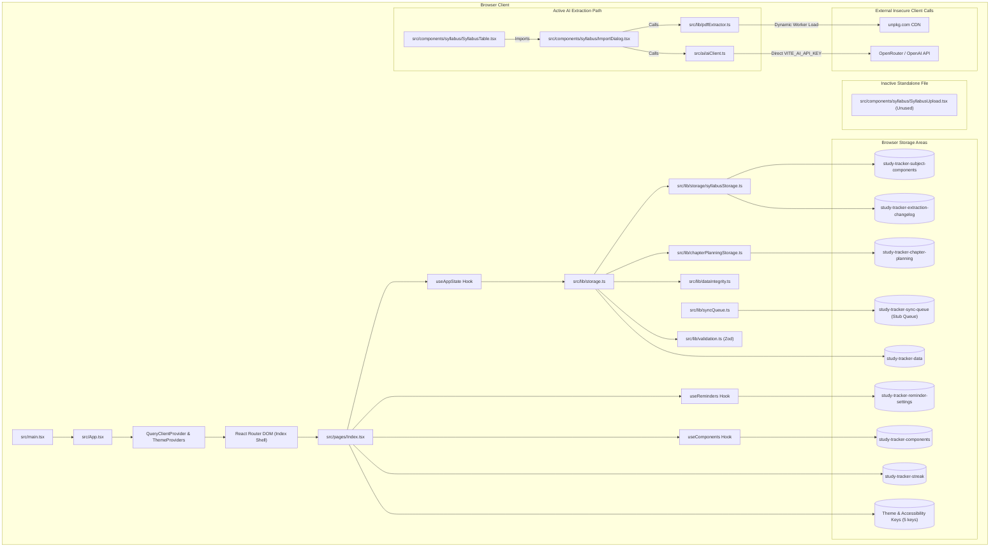
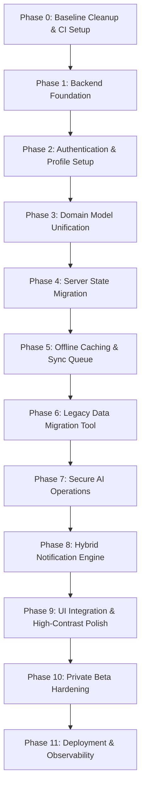

# Study Buddy Hub — Stage 3 Repository Architecture Audit

**Document Status:** READ-ONLY Technical Architecture Audit Report (Stage 3 Revision)  
**Project Phase:** Stage 3 Architecture Audit & Technical Feasibility Verification  
**Target Architecture:** Supabase (Auth, RLS, Edge Functions, Postgres) + TanStack Query + IndexedDB Offline Caching + React / Vite / TypeScript  
**Authoritative Product Scope Source of Truth:** `docs/STUDY_BUDDY_HUB_STAGE_2_REQUIREMENTS_SCOPE.md`  
**Prior Plan Reference:** `docs/STUDY_BUDDY_HUB_REVIVAL_PLAN.md`  

> **Stabilization note (2026-08-07):** This document records the pre-stabilization
> audit baseline. The current working branch removes the browser-side AI secret and
> direct provider transport described below; production AI remains deferred until a
> secure server-side transport is implemented. See `README.md` and
> `docs/security/SECURITY_NOTES.md` for the current boundary.

---

## 1. Executive Verdict

**Verdict: HIGHLY FEASIBLE FOR INCREMENTAL CLOUD MIGRATION (NO FRONTEND REWRITE REQUIRED)**

The Study Buddy Hub repository (`CapsCodes234/study-buddy-hub`) is a functional React 18, TypeScript 5.8, and Vite 5 web application. Its existing client routing (`react-router-dom` v6), UI component trees, data structures, and client-side business logic (analytics, progress weighting, streak tracking, CSV parsing) provide substantial product value.

A full frontend rewrite is **neither necessary nor recommended**. However, because the current codebase was constructed as a local-first browser application with fragmented persistence across 17 `localStorage` keys and zero authentication, cloud migration requires incremental integration changes across data hooks, state providers, and selected UI components (for loading, error, and sync feedback).

### Key Executive Findings:
1. **Frontend Architecture:** Preserves React, TypeScript, Vite, Tailwind CSS, and shadcn/ui. UI components can be retained while refactoring data access from direct `localStorage` calls to repository hooks powered by TanStack Query.
2. **Active vs Unused AI Components (`AI-001`):** Import inspection confirms that **`src/components/syllabus/ImportDialog.tsx` is the active AI/PDF syllabus extraction interface** (imported by `SyllabusTable.tsx`). Conversely, `src/components/syllabus/SyllabusUpload.tsx` is an unimported, inactive component.
3. **AI Proxying & Truncation (`SEC-001` / `AI-002`):** Current AI extraction directly reads `VITE_AI_API_KEY` from client environment variables (`src/ai/aiClient.ts` lines 276, 312) and silently truncates PDF text to 12,000 characters in `src/ai/prompts.ts` (line 181). This must be moved behind secure backend functions (e.g. Supabase Edge Functions).
4. **Duplicate Domain Models (`DATA-001`):** Two overlapping exam component models exist (`Component` in `src/types/components.ts` and `SubjectComponent` in `src/types/syllabus.ts`). A unified `ExamComponent` model is recommended for evaluation during Stage 3 schema design.
5. **Package Manager Standardisation (`BASELINE-001`):** `package-lock.json` is the active, canonical lockfile. `bun.lock` (248,052 bytes) and `bun.lockb` (198,722 bytes) are unreferenced in scripts, CI, and deployment workflows, and can be safely removed.

---

## 2. Audit Method and Limitations

### Method
This audit was conducted strictly in a READ-ONLY state using repository inspection, import tracing, safe build commands (`cmd /c npm run build`), TypeScript compilation verification (`cmd /c npx tsc --noEmit`), ESLint code quality checks (`cmd /c npm run lint`), and Vitest test suite execution (`cmd /c npx vitest run`).

### Limitations
- No live backend infrastructure (Supabase PostgreSQL project or Edge Functions) is currently connected to this workspace.
- Third-party AI requests were evaluated via code inspection of `src/ai/aiClient.ts` and `src/ai/prompts.ts`.
- Mobile layout behavior was verified through static breakpoint inspection of responsive Tailwind utility classes.

---

## 3. Repository Baseline

- **Active Branch:** `main` (verified up to date with `origin/main`, working tree clean).
- **Node.js Environment:** Windows environment, PowerShell / CMD shell context.
- **Lockfile & Package Manager Verification:**
  - `package-lock.json` (498,742 bytes) — Active canonical lockfile.
  - `bun.lock` (248,052 bytes) and `bun.lockb` (198,722 bytes) — Present but unreferenced in `package.json`, Vercel configs, or scripts.
- **Verdict on `bun.lock`:** `bun.lock` and `bun.lockb` can be safely removed. `npm` is the sole supported package manager.

### Automated Command Verification Results:
| Command | Exit Code | Result Summary | Affected / Details |
|---|---|---|---|
| `git status` | 0 | Working tree clean | Repository root |
| `git branch --show-current` | 0 | `main` | Repository root |
| `cmd /c npx tsc --noEmit` | 0 | 0 Type errors | Strict mode disabled (`strict: false` in `tsconfig.app.json`) |
| `cmd /c npm run lint` | 0 | 19 Warnings, 0 Errors | Fast Refresh exports (16), React hook deps (3) |
| `cmd /c npx vitest run` | 1 | 8 Test Files, 94 Tests: 88 Passed, 6 Failed | All 6 failures isolated to `src/lib/__tests__/parseHelpers.test.ts` |
| `cmd /c npm run build` | 0 | Built successfully in 1m 4s | 2 CSS syntax warnings (`-: –;` and `-: –—;`) |

---

## 4. Verified Technology Stack

| Technology | Repository Version | Location in Codebase | Target Role in Stage 3 Architecture |
|---|---|---|---|
| **React** | `^18.3.1` | `package.json` L55 | Main UI Library (Retained) |
| **TypeScript** | `^5.8.3` | `package.json` L86 | Type Safety & Domain Definitions (Retained) |
| **Vite** | `^5.4.19` | `package.json` L88, `vite.config.ts` | Build Tool & Dev Server (Retained) |
| **React Router DOM** | `^6.30.1` | `package.json` L60, `src/App.tsx` | Client Routing (Retained) |
| **Tailwind CSS** | `^3.4.17` | `package.json` L85, `tailwind.config.ts` | Styling System (Retained) |
| **shadcn/ui / Radix UI** | Various primitives | `package.json` L15-41, `src/components/ui/` | UI Components (Retained; ghost buttons to be updated) |
| **TanStack Query** | `^5.83.0` | `package.json` L42, `src/App.tsx` L55 | Currently wraps app; to be expanded for server state & caching |
| **Zod** | `^3.25.76` | `package.json` L68, `src/lib/validation.ts` | Data Validation & AI Output Validation (Retained) |
| **Recharts** | `^2.15.4` | `package.json` L61, `src/components/dashboard/` | Analytics Charting (Retained) |
| **pdfjs-dist** | `^5.4.449` | `package.json` L54, `src/lib/pdfExtractor.ts` | Client PDF Text Extraction (Retained for preview) |
| **Vitest** | `^4.0.16` | `package.json` L67, `vitest.config.ts` | Unit & Integration Testing (Retained) |
| **vite-plugin-pwa** | `^1.2.0` | `package.json` L66, `vite.config.ts` L15 | Service Worker & Web Manifest (Retained) |

---

## 5. Current Architecture Diagram



---

## 6. Folder and Module Map

### Main Source Structure (`src/`)
- **`src/main.tsx`**: Entry point. Registers PWA service worker and mounts `App`.
- **`src/App.tsx`**: Top-level provider tree (`QueryClientProvider`, `ThemeProvider`, `SubjectThemeProvider`, `BrowserRouter`) and route declarations.
- **`src/pages/`**:
  - `Index.tsx`: Central route shell reading `subjectId` params and rendering Dashboard, Settings, Exams, or Subject sub-views.
  - `NotFound.tsx`: 404 fallback page.
  - `ThemeDemo.tsx`: Theme preview utility page.
  - `subjects/`: `SubjectOverview.tsx`, `SubjectSyllabus.tsx`, `SubjectPapers.tsx` (Lazy-loaded views).
- **`src/hooks/`**:
  - `useAppState.ts`: Main state management hook reading/writing `storage.ts`.
  - `useComponents.ts`: Hook managing paper components via `study-tracker-components`.
  - `useReminders.ts`: Hook managing notification settings via `study-tracker-reminder-settings`.
  - `useMobile.tsx`, `useToast.ts`, `useKeyboardShortcuts.ts`.
- **`src/lib/`**:
  - `storage.ts`: Monolithic 746-line local-storage persistence manager and export/import handler.
  - `validation.ts`: Zod schemas for `AppState`, `Bullet`, `PastPaper`, CSV cell sanitization, and prototype pollution guards.
  - `dataIntegrity.ts`: Deduplication utilities for bullets, papers, and components.
  - `csvImport.ts`: Canonical CSV parsing, header mapping, and validation.
  - `pdfExtractor.ts`: PDF text extraction using `pdfjs-dist`.
  - `syncQueue.ts`: Offline queue stub for pending status/notes changes.
  - `streak.ts`, `notifications.ts`, `chapterCompletion.ts`, `chapterPlanningStorage.ts`, `subjectThemes.ts`, `contrastChecker.ts`.
  - `insights/`: Domain analytics for weighting, readiness, exam simulation, and subject health.
  - `storage/syllabusStorage.ts`: Secondary functions for subject components and changelogs.
- **`src/ai/`**:
  - `aiClient.ts`: Provider factory for OpenRouter, OpenAI, and Mock mode.
  - `prompts.ts`: Prompt templates (includes 12,000 character truncation logic).
  - `guards.ts`, `types.ts`, `summarizer.ts`.
- **`src/types/`**:
  - `index.ts`: Core models (`Subject`, `Bullet`, `PastPaper`, `AppState`, `AppSettings`, `FocusItem`).
  - `components.ts`: Custom `Component` interface definition.
  - `syllabus.ts`: `SubjectComponent`, `ExtractionResult`, `ReminderSettings` definitions.
  - `paper.ts`, `chapterPlanning.ts`, `reminders.ts`.

---

## 7. Feature-to-Code Map

| Feature Area | Implementation Files | Storage Dependencies | Status |
|---|---|---|---|
| **Authentication Placeholders** | None (No auth code present) | None | **Not found / Stub** |
| **Onboarding** | `src/components/layout/OnboardingModal.tsx` | `study-tracker-data` (`settings.hasCompletedOnboarding`) | **Active and functional** |
| **Dashboard** | `src/components/dashboard/Dashboard.tsx`, `TodayFocus.tsx`, `NextActionPanel.tsx`, `ReadinessWidget.tsx` | `study-tracker-data` | **Active and functional** |
| **Subject Setup** | `src/pages/Index.tsx`, `src/lib/storage.ts` (`DEFAULT_SUBJECTS`) | `study-tracker-data` | **Active and functional** |
| **Syllabus Tracking** | `src/pages/subjects/SubjectSyllabus.tsx`, `CollapsibleSyllabus.tsx`, `BulletRow.tsx` | `study-tracker-data` | **Active and functional** |
| **Confidence States** | `src/components/ui/ConfidenceToggle.tsx`, `src/types/index.ts` (`Status`) | `study-tracker-data` | **Active and functional** |
| **Syllabus Notes** | `src/components/syllabus/NotesPanel.tsx` | `study-tracker-data` (`Bullet.comment`) | **Active and functional** |
| **CSV Import** | `src/components/syllabus/CSVMappingModal.tsx`, `src/lib/csvImport.ts`, `src/lib/storage.ts` | In-memory merge → `study-tracker-data` | **Active and functional** |
| **PDF/AI Extraction** | `src/components/syllabus/ImportDialog.tsx`, `src/lib/pdfExtractor.ts`, `src/ai/aiClient.ts` | `study-tracker-extraction-changelog` | **Active but incomplete (Truncates 12k chars, exposes API key)** |
| **PDF Upload Component (Standalone)** | `src/components/syllabus/SyllabusUpload.tsx` | None (Unimported file) | **Unused / Legacy** |
| **Paper Components** | `src/hooks/useComponents.ts`, `src/types/components.ts`, `src/types/syllabus.ts` | `study-tracker-components` AND `study-tracker-subject-components` | **Duplicate implementation** |
| **Past-Paper Attempts** | `src/pages/subjects/SubjectPapers.tsx`, `src/components/papers/PastPapers.tsx`, `PastPaperDialog.tsx` | `study-tracker-data` (`pastPapers`) | **Active and functional** |
| **Analytics** | `src/lib/paperAnalytics.ts`, `componentAnalytics.ts`, `src/lib/insights/*` | Derived in-memory from `pastPapers` & `bullets` | **Active and functional** |
| **Daily Focus** | `src/components/dashboard/TodayFocus.tsx`, `src/lib/focus.ts`, `src/ai/summarizer.ts` | Derived from app state / AI API | **Active and functional** |
| **Study Summary** | `src/components/dashboard/Dashboard.tsx`, `src/ai/summarizer.ts` | Derived from app state / AI API | **Active and functional** |
| **Reflections** | `src/components/reflection/WeeklyReflection.tsx` | `study-tracker-reflections` | **Active and functional** |
| **Streaks** | `src/components/ui/StreakCounter.tsx`, `src/lib/streak.ts` | `study-tracker-streak` | **Active and functional** |
| **Milestones** | `src/components/motivation/MilestoneToast.tsx` | `study-tracker-milestones` | **Active and functional** |
| **Deadlines** | `src/components/syllabus/ChapterDeadlinePicker.tsx`, `src/lib/chapterPlanningStorage.ts` | `study-tracker-chapter-planning` | **Active but incomplete (String-based chapter keys)** |
| **Exams/Reminders** | `src/pages/Exams.tsx`, `src/components/reminders/UpcomingReminders.tsx`, `src/lib/notifications.ts` | `study-tracker-reminder-settings`, `study-tracker-exam-schedule` | **Active but incomplete (No FCM or Push server)** |
| **Notifications** | `src/lib/notifications.ts`, `src/hooks/useReminders.ts` | Web Notification API / Local timers | **Stub / Placeholder (No cloud backend)** |
| **Backup / Export / Import** | `src/components/settings/Settings.tsx`, `src/lib/storage.ts` (`exportAsJSON`, `importFromJSON`) | Export JSON (v4 schema) | **Active and functional** |
| **Settings** | `src/components/settings/Settings.tsx` | `study-tracker-data` (`settings`) | **Active and functional** |
| **Themes & Accents** | `src/components/ui/ThemeProvider.tsx`, `src/components/providers/SubjectThemeProvider.tsx` | `theme`, `subject-theme-overrides` | **Active and functional** |
| **Accessibility** | `src/components/settings/AccessibilitySettings.tsx`, `src/lib/contrastChecker.ts` | `accessibility-settings` | **Active and functional** |
| **Offline / PWA** | `vite-plugin-pwa`, `src/main.tsx`, `src/lib/syncQueue.ts` | ServiceWorker cache, `study-tracker-sync-queue` | **Active but incomplete (Sync queue is a stub)** |

---

## 8. Current Data-Flow Analysis

### Flow 1: Creating or Selecting a Subject
```text
UI (Header.tsx / Dashboard.tsx)
→ Router handler (navigate('/math/syllabus'))
→ Route validation (Index.tsx subjectId lookup in state.subjects)
→ Service / Storage (useAppState.ts -> storage.ts loadData())
→ Persistence Key (localStorage.getItem('study-tracker-data'))
→ State refresh (SubjectThemeProvider updates CSS accent variables)
→ Displayed result (Subject syllabus view rendered with theme accents)
```
*Bypass Note: `SubjectThemeProvider` also directly accesses `localStorage['subject-theme-overrides']` independently of `useAppState`.*

### Flow 2: Importing a Syllabus through CSV
```text
UI (ImportDialog.tsx / CSVMappingModal.tsx)
→ Hook handler (onImport callback -> storage.ts importBulletsFromCSV())
→ Validation (validateCSVBullet() & sanitizeCSVCell() formula injection defense)
→ Service / Storage (addBullets() in useAppState.ts merges array)
→ Persistence Key (saveData() -> localStorage.setItem('study-tracker-data'))
→ State refresh (setState() triggers re-render of SubjectSyllabus.tsx)
→ Displayed result (New syllabus topics render in accordion list)
```

### Flow 3: Updating a Syllabus Confidence State
```text
UI (ConfidenceToggle.tsx inside BulletRow.tsx)
→ Hook handler (onUpdateStatus() -> Index.tsx handleUpdateBullet())
→ Validation (Typed Status check: 'Red' | 'Amber' | 'Green' | null)
→ Service / Storage (useAppState.ts updateBullet() & recordActivity() & addToSyncQueue())
→ Persistence Key (localStorage writes to 'study-tracker-data', 'study-tracker-streak', and 'study-tracker-sync-queue')
→ State refresh (State update triggers component re-render)
→ Displayed result (Badge color updates; progress bar animates; streak counter increments)
```
*Bypass Note: `addToSyncQueue()` accesses `localStorage['study-tracker-sync-queue']` directly outside `useAppState`.*

### Flow 4: Adding a Syllabus Note
```text
UI (NotesPanel.tsx textarea)
→ Hook handler (saveNotes() -> updateBullet(bulletId, { comment }))
→ Validation (Text sanitization via sanitizeText())
→ Service / Storage (useAppState.ts updateBullet() -> saveData())
→ Persistence Key (localStorage.setItem('study-tracker-data'))
→ State refresh (Local bullet state updated)
→ Displayed result (Notes indicator icon lights up on BulletRow)
```

### Flow 5: Recording a Past-Paper Attempt
```text
UI (PastPaperDialog.tsx form submission)
→ Hook handler (onAddPaper() / onUpdatePaper() -> Index.tsx handleUpdatePaper())
→ Validation (Number bounds check: rawScore <= totalMarks, positive duration)
→ Service / Storage (useAppState.ts addPastPaper() -> saveData())
→ Persistence Key (localStorage.setItem('study-tracker-data'))
→ State refresh (PastPapers.tsx re-renders paper list and metrics)
→ Displayed result (Paper logged; component analytics & percentage recalculate)
```

### Flow 6: Calculating Dashboard Analytics
```text
UI (Dashboard.tsx mounting)
→ Hook handler (useAppState.ts supplies state.bullets and state.pastPapers)
→ Validation (In-memory array filtering for completed items)
→ Service / Storage (paperAnalytics.ts, componentAnalytics.ts, readiness.ts)
→ Persistence Key (In-memory calculation from loaded 'study-tracker-data')
→ State refresh (Dashboard state memoization)
→ Displayed result (Readiness widget, paper completion charts, weakness map render)
```

### Flow 7: Exporting and Importing a Backup
```text
UI (Settings.tsx Export / Import buttons)
→ Hook handler (exportAsJSON() / importFromJSON() in storage.ts)
→ Validation (Schema validation via Zod appStateSchema + safeJSONParse)
→ Service / Storage (Storage facade gathers secondary keys: components, chapter plannings, changelogs)
→ Persistence Key (Reads/Writes 'study-tracker-data', 'study-tracker-components', 'study-tracker-subject-components', etc.)
→ State refresh (importState() replaces entire useAppState memory state)
→ Displayed result (Toast notification displays imported counts; UI refreshes completely)
```

### Flow 8: Current PDF/AI Extraction Flow
```text
UI (ImportDialog.tsx PDF file drop)
→ Hook handler (handlePDFExtraction(file))
→ Validation (pdfText.length > 0 check)
→ Service / Storage (pdfExtractor.ts extractTextFromPDF() -> aiClient.ts extractSyllabusFromPDF())
→ Persistence Key (Exposed client fetch to OpenRouter API; saves result to 'study-tracker-extraction-changelog')
→ State refresh (setExtraction() opens review step)
→ Displayed result (Extracted topics shown in preview modal before save)
```
*Bypass Note: Direct fetch call reads `VITE_AI_API_KEY` from client environment, bypassing backend proxy.*

### Flow 9: Current Reminder or Notification Flow
```text
UI (Exams.tsx / UpcomingReminders.tsx)
→ Hook handler (useReminders.ts hook)
→ Validation (Date comparison against mainExamLeadDays)
→ Service / Storage (notifications.ts scheduleNotification() using Web Notification API)
→ Persistence Key (localStorage['study-tracker-reminder-settings'])
→ State refresh (upcomingReminders state array updated)
→ Displayed result (Desktop browser notification pop-up triggered via browser API)
```

### Flow 10: Offline/PWA Startup and Update Flow
```text
UI (Browser load / PWA install banner)
→ Hook handler (virtual:pwa-register SW registration in main.tsx)
→ Validation (Service worker support check in navigator)
→ Service / Storage (vite-plugin-pwa autoUpdate registerSW())
→ Persistence Key (CacheStorage API for static assets only)
→ State refresh (Service worker takes control; offline assets cached)
→ Displayed result (The app shell and existing localStorage user data remain
available offline; future supported cloud data will use IndexedDB caching.)
```
*Note: Current PWA implementation caches the application shell (HTML, CSS, JS bundles) via service worker and Cache Storage. Existing locally stored user data remains available through localStorage. After cloud migration, supported syllabus and past-paper data will be cached in IndexedDB for offline workflows.*

---

## 9. Browser-Storage Inventory

The repository contains **17 total `localStorage` keys** (12 primary application data keys + 5 UI/theme/device preference keys). IndexedDB is not currently used for application data storage.

| Key | Declared In File | Read By Files | Written By Files | Purpose | Expected Data Shape | Private Data? | Currently Authoritative? | Proposed Future Destination | Migration Risk | Device Local? |
|---|---|---|---|---|---|---|---|---|---|---|
| **Primary App Data Keys (12 Keys)** | | | | | | | | | | |
| 1. `study-tracker-data` | `src/lib/storage.ts` | `storage.ts`, `useAppState.ts` | `storage.ts` | Main application state | `AppState` (subjects, bullets, pastPapers, settings) | Yes | Yes | Supabase PostgreSQL (`subjects`, `bullets`, `past_papers`, `user_settings`) | High | No |
| 2. `study-tracker-components` | `src/lib/storage.ts`, `dataIntegrity.ts` | `useComponents.ts`, `dataIntegrity.ts`, `storage.ts` | `useComponents.ts`, `dataIntegrity.ts`, `storage.ts` | Custom paper component metadata | `Component[]` array | Yes | Yes | Supabase `exam_components` table | Medium | No |
| 3. `study-tracker-subject-components` | `src/lib/storage/syllabusStorage.ts` | `syllabusStorage.ts`, `storage.ts` | `syllabusStorage.ts`, `storage.ts` | Default subject component metadata | `SubjectComponent[]` array | No | Yes | Supabase `exam_components` table | Medium | No |
| 4. `study-tracker-chapter-planning` | `src/lib/chapterPlanningStorage.ts` | `chapterPlanningStorage.ts`, `storage.ts` | `chapterPlanningStorage.ts`, `storage.ts` | Chapter planning deadlines | `ChapterPlanning[]` array | Yes | Yes | Supabase `chapter_deadlines` table | Low | No |
| 5. `study-tracker-streak` | `src/lib/streak.ts` | `streak.ts`, `Index.tsx` | `streak.ts` | Study streak & activity history | `StreakData` object | Yes | Yes | Supabase `user_activity_logs` / derived view | Low | No |
| 6. `study-tracker-milestones` | `src/components/motivation/MilestoneToast.tsx` | `MilestoneToast.tsx` | `MilestoneToast.tsx` | Milestones toast tracking | `string[]` array | Yes | Yes | IndexedDB / Supabase `user_milestones` | Low | No |
| 7. `study-tracker-sync-queue` | `src/lib/syncQueue.ts` | `syncQueue.ts`, `SyncStatusIndicator.tsx` | `syncQueue.ts` | Offline pending operations queue | `QueuedChange[]` array | Yes | No (Stub) | IndexedDB `pending_ops` store | High | Yes |
| 8. `study-tracker-reminder-settings` | `src/types/syllabus.ts`, `useReminders.ts` | `useReminders.ts`, `Settings.tsx` | `useReminders.ts`, `Settings.tsx` | Exam lead time reminder settings | `ReminderSettings` object | Yes | Yes | Supabase `notification_preferences` | Low | No |
| 9. `study-tracker-weighting` | `src/lib/insights/weighting.ts` | `weighting.ts` | `weighting.ts` | Subject/topic custom progress weights | `Record<string, number>` | Yes | Yes | Supabase `user_settings` | Low | No |
| 10. `study-tracker-exam-schedule` | `src/lib/examSchedule.ts` | `examSchedule.ts`, `Exams.tsx` | `examSchedule.ts` | Exam schedule entries | `ExamScheduleEntry[]` array | Yes | Yes | Supabase `exam_events` table | Medium | No |
| 11. `study-tracker-reflections` | `src/components/reflection/WeeklyReflection.tsx` | `WeeklyReflection.tsx` | `WeeklyReflection.tsx` | Weekly study journals | `ReflectionEntry[]` array | Yes | Yes | Supabase `weekly_reflections` table | Low | No |
| 12. `study-tracker-extraction-changelog` | `src/lib/storage/syllabusStorage.ts` | `syllabusStorage.ts`, `storage.ts` | `syllabusStorage.ts` | AI PDF extraction history log | `ExtractionChangelog[]` array | Yes | Yes | Supabase `ai_extraction_logs` | Low | No |
| **UI, Theme & Device Preference Keys (5 Keys)** | | | | | | | | | | |
| 13. `chapter-completion-celebrated` | `src/lib/chapterCompletion.ts` | `chapterCompletion.ts` | `chapterCompletion.ts` | Celebrated chapter animation flags | `Record<string, boolean>` | No | UI state | LocalStorage (Device Local) | None | Yes |
| 14. `subject-theme-overrides` | `src/components/providers/SubjectThemeProvider.tsx` | `SubjectThemeProvider.tsx` | `SubjectThemeSettings.tsx` | Subject accent color overrides | `Record<string, Override>` | Yes | Yes | LocalStorage / Supabase user prefs | Low | Yes |
| 15. `theme` | `src/components/ui/ThemeProvider.tsx` | `ThemeProvider.tsx` | `ThemeProvider.tsx` | Global UI appearance mode | `'dark' \| 'light' \| 'system'` | No | Yes | LocalStorage (Device Local) | None | Yes |
| 16. `accessibility-settings` | `src/components/settings/AccessibilitySettings.tsx` | `AccessibilitySettings.tsx` | `AccessibilitySettings.tsx` | High contrast & motion prefs | `AccessibilitySettings` object | No | Yes | LocalStorage (Device Local) | None | Yes |
| 17. `vite-ui-theme` | `src/components/ui/ThemeProvider.tsx` | `ThemeProvider.tsx` | `ThemeProvider.tsx` | Fallback theme key | String | No | No | LocalStorage (Device Local) | None | Yes |
| **Proposed Future Storage (Not Currently Active)** | | | | | | | | | |
| 18. IndexedDB (future offline cache) | Not implemented | N/A | N/A | Proposed for TanStack Query offline persistence | Structured browser stores | Yes | Not applicable | IndexedDB (TanStack Query Offline Cache) | N/A | Yes |

---

## 10. Domain-Model and Duplicate-Type Analysis

### Existing Exam Component Models
The repository contains two separate component interfaces:

1. **`Component`** (`src/types/components.ts` L1–11):
   - Fields: `id`, `subjectId`, `componentName`, `paperCode`, `durationMin`, `totalMarks`, `weightingPercent`, `createdAt`, `updatedAt`.
   - Storage: `localStorage['study-tracker-components']`.
2. **`SubjectComponent`** (`src/types/syllabus.ts` L5–12):
   - Fields: `id`, `subjectId`, `name`, `totalMarks`, `weight`, `orderNumber`.
   - Storage: `localStorage['study-tracker-subject-components']`.

### Proposed Unified Domain Model (`ExamComponent`)
To eliminate field duplication, Stage 3 recommends unifying these into one canonical domain interface:

```typescript
export interface ExamComponent {
  id: string; // UUID
  subjectId: string; // Relational link to subject
  name: string; // e.g. "Paper 1: Multiple Choice"
  paperCode: string; // e.g. "9709/11"
  durationMinutes: number; // e.g. 75
  totalMarks: number; // e.g. 75
  weightingPercent: number; // e.g. 30.0
  displayOrder: number; // e.g. 1
  isCustom: boolean; // false for catalogue defaults, true for user-added
  userId?: string; // Nullable for global catalogue, populated for custom
  createdAt: string;
  updatedAt: string;
}
```

### Stage 3 Relational Database Schema Options for Evaluation
The final database implementation choice is deferred to Stage 3 schema design:
- **Option A (Two Tables):** `syllabus_components` (shared global catalogue read-only table) and `custom_user_components` (private user table).
- **Option B (Single Constrained Table):** `exam_components` table with a nullable `user_id` column (`user_id IS NULL` represents global catalogue records; `user_id = auth.uid()` represents custom user records).

---

## 11. Storage-Layer Audit

`src/lib/storage.ts` is currently a 746-line facade file serving multiple unrelated responsibilities:
- Main state loading and saving (`loadData`, `saveData`).
- Full data clearing (`clearAllAppData`).
- JSON backup export and import (`exportAsJSON`, `importFromJSON`).
- CSV bullet export and import (`exportBulletsAsCSV`, `importBulletsFromCSV`).

### Proposed Storage Refactoring Plan
```text
Current storage.ts Function -> Target Repository Service -> Supabase Table / Storage Mechanism
---------------------------------------------------------------------------------------------------
loadData() / saveData() -> SubjectRepository & SyllabusRepository -> Supabase Postgres + TanStack Query
importFromJSON() -> MigrationService & ExportRepository -> Supabase RPC / Batch Client Insert
importBulletsFromCSV() -> CSVImportService -> Supabase Batch Insert + Zod Validation
loadAndDedupeComponents() -> ComponentRepository -> Supabase `exam_components` Table
clearAllAppData() -> Auth & Cache Manager -> Supabase Auth SignOut + Local IndexedDB Wipe
```

---

## 12. CSV / Import / Backup Audit

### Canonical Active CSV Importer
The active CSV import pipeline is implemented in **`src/lib/csvImport.ts`** and **`src/lib/storage.ts` (`importBulletsFromCSV`)**.
- Supports flexible header matching (`main_topic`, `subtopic`, `learning_outcome` / `bullet`, `subject`).
- Formula injection protection exists via `sanitizeCSVCell()` (escapes `=`, `+`, `-`, `@`).
- Automatic deduplication uses normalized composite key: `${subjectId}|${mainTopic}|${subtopic}|${bulletText}`.

### Re-evaluation of Unit Test Failures
The test execution of `cmd /c npx vitest run` confirmed **6 failing tests** out of 94, all inside `src/lib/__tests__/parseHelpers.test.ts`:
1. `extractComponentMarks > extracts marks from "Paper 1 — 40 marks"`: Fails due to regex em-dash `—` handling versus hyphen `-`. (Possible parser defect).
2. `parseTopicNumbering > parses numbered topics`: Fails due to expectation mismatch (`cleanText`/`level`/`number` vs `orderNumber`/`name`).
3. `parseTopicNumbering > parses topics with dot notation`: Expectation mismatch.
4. `parseTopicNumbering > handles topics without numbers`: Expectation mismatch.
5. `isLikelySubtopic > identifies letter-prefixed items`: Fails on `(b) Velocity` (Possible parser defect).
6. `isLikelyBullet > identifies action verb starts`: Fails on lowercase verb detection (Possible parser defect).

**Audit Recommendation:** Do NOT modify unit tests or parser code during this stage. These failures represent implementation-versus-expectation mismatches and potential parser defects that must be investigated and resolved against confirmed product requirements during Phase 0 of implementation.

---

## 13. AI Implementation Analysis

### Active vs Inactive AI Components
- **Active Interface:** `src/components/syllabus/ImportDialog.tsx` is imported by `SyllabusTable.tsx` and provides the active PDF file drop and AI extraction review workflow.
- **Inactive Interface:** `src/components/syllabus/SyllabusUpload.tsx` is an unimported, standalone file.

### Critical AI Defects & Vulnerabilities Confirmed:
1. **Client API Key Exposure (`SEC-001`):** `src/ai/aiClient.ts` (lines 276, 312) reads `import.meta.env.VITE_AI_API_KEY` directly in client code, exposing secrets in browser requests.
2. **Silent Text Truncation (`AI-002`):** `src/ai/prompts.ts` (line 181) explicitly cuts off PDF text:
   `const truncatedText = pdfText.length > 12000 ? pdfText.substring(0, 12000) + '\n[... content truncated ...]' : pdfText;`
3. **Missing Server Rate Controls:** No user quotas or backend throttling exist.

### Backend Proxy Requirement:
All AI requests must be removed from browser code and routed through a protected backend function (e.g. Supabase Edge Function `supabase/functions/extract-syllabus/index.ts`) using a document-capable Gemini model benchmarked during implementation.

---

## 14. PWA and Offline Audit

- **PWA Tooling:** Configured via `vite-plugin-pwa` in `vite.config.ts` (Auto-update mode, fallback `/`).
- **Offline Queue Audit:** `src/lib/syncQueue.ts` manages `localStorage['study-tracker-sync-queue']`.
  - **Verdict:** The queue is a **minimal stub**. It supports only `status` and `notes` changes on bullets. It lacks retry backoff, transaction IDs, server version tracking, conflict handling, and multi-entity support.
- **Recommendation:** Replace `syncQueue.ts` with an IndexedDB store backing TanStack Query's offline persister (`createPersister` / `onlineManager`).

---

## 15. Authentication and Cloud-Readiness Audit

- **Current State:** No authentication code exists. Data models lack a `user_id` field.
- **Required Supabase Auth & RLS Model:**
  - Add `user_id uuid references auth.users(id) not null default auth.uid()` to all private tables.
  - Implement comprehensive, tested Row Level Security policies for `SELECT`, `INSERT`, `UPDATE`, and `DELETE` operations using both `USING` and `WITH CHECK` clauses.

#### Example RLS Policy Guidance:
```sql
-- SELECT Policy
CREATE POLICY "Users view own bullets" ON bullets
  FOR SELECT USING (auth.uid() = user_id);

-- INSERT Policy
CREATE POLICY "Users insert own bullets" ON bullets
  FOR INSERT WITH CHECK (auth.uid() = user_id);

-- UPDATE Policy
CREATE POLICY "Users update own bullets" ON bullets
  FOR UPDATE USING (auth.uid() = user_id) WITH CHECK (auth.uid() = user_id);

-- DELETE Policy
CREATE POLICY "Users delete own bullets" ON bullets
  FOR DELETE USING (auth.uid() = user_id);
```

---

## 16. Notification and Integration Audit

- **Current Implementation:** `src/lib/notifications.ts` and `src/hooks/useReminders.ts` use local browser `Notification` API and `setTimeout`/`setInterval`.
- **Stage 2 Platform Boundary Compliance:**
  - **Supabase:** Authoritative store for notification records, schedules, preferences, device FCM tokens.
  - **Firebase Cloud Messaging (FCM):** Used ONLY as a push delivery pipe. No Firebase Auth or Firestore.
  - **Google Calendar / Email:** Kept as separate, future optional channel adapters. Mailbox integrations (Gmail, Outlook, iCloud) remain outside Web v1.

---

## 17. UI/UX Technical Architecture Risks

- **Incremental UI Changes Required:** While no full frontend rewrite is needed, integration will require incremental updates to data hooks, state providers, loading skeletons, error fallbacks, and sync indicators across selected components.
- **Ghost Button Replacement (`UX-001`):** `grep_search` identified 25 files using `variant="ghost"` (e.g. `BulletRow.tsx`, `PastPapers.tsx`, `SubjectOverview.tsx`). End-user action buttons must be updated to filled or bordered styles (`variant="outline"` / `variant="secondary"`).
- **Mobile Viewport Overflow (`UX-002`):** Dialogs in `PastPaperDialog.tsx` and `ImportDialog.tsx` use fixed pixel min-widths that overflow on 375px screens. Responsive Tailwind utility classes (`max-w-full sm:max-w-lg`) must be enforced.

---

## 18. Testing and CI Baseline

- **Current Test Engine:** Vitest 4.0.16 + JSDOM 27.3.0 + React Testing Library 16.3.1.
- **Current Coverage:** 8 test files, 94 tests (88 passing, 6 failing in `parseHelpers.test.ts`).
- **CI Pipeline:** No GitHub Actions workflow (`.github/workflows/`) currently exists.
- **Minimum Gate:** A GitHub Actions workflow running `npm run lint`, `npx tsc --noEmit`, and `npm test` must be established in Phase 0.

---

## 19. Security and Privacy Findings

| Finding ID | Severity | Confidence | Type | Description | Evidence Location | Impact | Recommendation |
|---|---|---|---|---|---|---|---|
| **SEC-001** | **Critical** | Confirmed | Vulnerability | Client-side AI API key exposure in bundle | `src/ai/aiClient.ts` L276 | Anyone can extract key & abuse paid API quota | Proxy AI requests through Supabase Edge Function |
| **SEC-002** | **Critical** | Confirmed | Vulnerability | Missing authentication & user data isolation | `src/types/index.ts`, `src/lib/storage.ts` | All local user data is unauthenticated | Implement Supabase Auth & RLS policies |
| **SEC-003** | **Medium** | Confirmed | Risk | Plaintext browser storage of private study data | `src/lib/storage.ts` L59 | Plaintext JSON in browser storage | Use IndexedDB for durable cache; encrypt manual export files |
| **SEC-004** | **Low** | Confirmed | Risk | PDF Worker loaded from un-pinned CDN without SRI | `src/lib/pdfExtractor.ts` L15 | Supply chain script tampering risk | Bundle worker locally or add SRI hashes |

*Note on Local Storage Security:* IndexedDB provides structured browser storage but does NOT provide automatic encryption. Unencrypted client storage is suitable for offline caching, while manual user data exports must be encrypted separately. Sensitive local storage should be minimized.

---

## 20. Deployment and Monitoring Findings

- **Hosting Platform:** Vercel (Vite SPA deployment ready via `index.html` and `vite.config.ts`).
- **Observability Evaluation:** Current codebase lacks centralized error logging or performance monitoring.
- **Stage 3 Requirement:** Conduct a provider-neutral monitoring evaluation for client error tracking and performance logging prior to private beta.

---

## 21. Fit-Gap Matrix

| Architecture Area | Current State | Evidence | Target State | Gap | Risk | Recommended Migration Step |
|---|---|---|---|---|---|---|
| **1. Frontend Structure** | React 18 + Vite 5 + TS 5.8 | `package.json` | React 18 + Vite 5 + TS 5.8 | None (Fits perfectly) | Low | Retain as-is |
| **2. Authentication** | None | No auth files | Supabase Auth (Email + OAuth) | 100% Gap | High | Add AuthProvider & Supabase SDK |
| **3. Database** | LocalStorage strings | `src/lib/storage.ts` | Supabase PostgreSQL | 100% Gap | High | Create schema & RLS policies |
| **4. User Ownership** | Single local user | `useAppState.ts` | `user_id` foreign keys & RLS | 100% Gap | High | Add `user_id` columns to all tables |
| **5. Repositories** | Monolithic `storage.ts` | `storage.ts` | Domain Repository Services | 80% Gap | Medium | Split `storage.ts` into repositories |
| **6. TanStack Query** | Installed but unused | `App.tsx` L55 | Server state management | 90% Gap | Medium | Wrap repository calls in Query hooks |
| **7. IndexedDB** | No active IndexedDB application-data store; generic browser-database cleanup logic only | `storage.ts` L691 | Durable offline cache & queue | 80% Gap | Medium | Implement IndexedDB adapter |
| **8. Offline Queue** | Stub queue in `syncQueue.ts` | `syncQueue.ts` | IndexedDB transaction queue | 80% Gap | Medium | Implement offline mutation queue |
| **9. Conflict Handling** | None | `useAppState.ts` | Version-based conflict detection | 100% Gap | Medium | Add update markers & conflict modal |
| **10. Local Migration** | None | `storage.ts` | Guided local-to-cloud migration wizard | 100% Gap | Medium | Build opt-in migration dialog |
| **11. Shared Catalogue** | Hard-coded default subjects | `storage.ts` L37 | Shared global syllabus tables | 80% Gap | Medium | Seed shared CAIE A-Level catalogue |
| **12. Component Model** | Two duplicate models | `components.ts` vs `syllabus.ts` | Unified `ExamComponent` model | Data model conflict | Medium | Unify models in Stage 3 schema design |
| **13. AI Extraction** | Client-side OpenRouter call | `aiClient.ts` | Protected Supabase Edge Function | Security & Truncation gap | High | Move extraction to Edge Function |
| **14. Notifications** | Local browser API | `notifications.ts` | Supabase DB + FCM Push pipe | 90% Gap | Low | Implement FCM Web Service Worker |
| **15. Google Calendar Boundary** | None | No calendar code | Separate optional future adapter | 100% Gap (Postponed) | Low | Keep integration boundary decoupled |
| **16. Email Boundary** | None | No email code | Transactional email provider | 100% Gap | Low | Use provider-agnostic email delivery |
| **17. Testing** | 8 files, 94 tests (6 failed) | `vitest.config.ts` | Vitest unit + Playwright E2E | Partial | Medium | Fix test expectation mismatches & add E2E |
| **18. CI Pipeline** | None | No `.github/` folder | GitHub Actions automated gate | 100% Gap | Medium | Create PR validation workflow |
| **19. Monitoring** | None | `src/` | Provider-neutral error tracking | 100% Gap | Low | Evaluate monitoring providers |
| **20. Security** | Exposed API key | `aiClient.ts` L276 | Server secrets & RLS enforcement | Critical Gap | High | Move secrets to backend & enforce RLS |
| **21. Cost Controls** | None | `aiClient.ts` | Per-user backend AI quotas | 100% Gap | Medium | Enforce quotas in Edge Functions |

---

## 22. Migration Impact Map

| Current File / Module | Current Responsibility | Future Responsibility | Action | Phase | Risk |
|---|---|---|---|---|---|
| `src/lib/storage.ts` | Monolithic local storage facade | Split into domain repositories + legacy fallback | **Split & Wrap** | Phase 1 - 4 | High |
| `src/hooks/useAppState.ts` | Main local state silo | Replaced by TanStack Query hooks | **Replace** | Phase 4 - 6 | High |
| `src/hooks/useComponents.ts` | Custom components hook | Replaced by `useExamComponents()` Query hook | **Replace** | Phase 3 | Medium |
| `src/ai/aiClient.ts` | Direct OpenRouter client | Supabase Edge Function API client | **Wrap / Move** | Phase 7 | High |
| `src/ai/prompts.ts` | AI prompts with 12k truncation | Server-side document-processing pipeline using provider-native document input or bounded chunking, with no silent content loss | **Refactor** | Phase 7 | High |
| `src/components/syllabus/ImportDialog.tsx` | Active PDF/AI import dialog | Uses Edge Function API & handles async state | **Modify** | Phase 7 | Medium |
| `src/components/syllabus/SyllabusUpload.tsx` | Unused standalone PDF upload file | Cleanup or retain as secondary reference | **Archive / Remove** | Phase 9 | Low |
| `src/lib/syncQueue.ts` | LocalStorage sync queue stub | IndexedDB persistent sync engine | **Replace** | Phase 5 | Medium |
| `src/types/components.ts` | Component interface definition | Merged into `src/types/syllabus.ts` canonical model | **Merge** | Phase 3 | Low |
| `src/lib/notifications.ts` | Browser notification wrappers | FCM registration & push listener | **Modify** | Phase 8 | Low |
| `src/lib/paperAnalytics.ts` | In-memory past-paper analytics | Retained in-memory analytics service | **Keep** | Phase 6 | Low |
| `src/lib/insights/*` | Readiness & weighting calculations | Retained domain logic services | **Keep** | Phase 6 | Low |
| `src/components/settings/Settings.tsx` | Settings page & clear data | Updated for auth, profile, & encrypted export | **Modify** | Phase 9 | Low |
| `bun.lock` / `bun.lockb` | Unused Bun lockfiles | None | **Remove** | Phase 0 | Low |

---

## 23. Recommended Implementation Sequence



### Phase Breakdown with Prerequisites, Test Gates, and Rollback Points:

#### Phase 0: Baseline Cleanup & CI Setup
- **Prerequisites:** None.
- **Actions:** Remove `bun.lock`/`bun.lockb`, investigate and resolve 6 unit test expectation mismatches in `parseHelpers.test.ts`, create `.github/workflows/ci.yml`.
- **Test Gate:** `npm run lint`, `npx tsc --noEmit`, and `npm test` pass cleanly with 0 errors.
- **Rollback Point:** Revert to `main` branch HEAD.

#### Phase 1: Backend Foundation (Supabase Setup)
- **Prerequisites:** Phase 0 complete.
- **Actions:** Initialize Supabase project, write PostgreSQL migration scripts for core tables (`subjects`, `bullets`, `past_papers`, `exam_components`, `user_settings`).
- **Test Gate:** Schema migrations apply cleanly on local Supabase CLI instance.
- **Rollback Point:** Drop created local database schema.

#### Phase 2: Authentication & Profile Setup
- **Prerequisites:** Phase 1 complete.
- **Actions:** Add Supabase Auth SDK, wrap `App.tsx` in `AuthProvider`, implement Login/Register (supporting username or email for password users, plus Google, Microsoft, Apple sign-in).
- **Test Gate:** User registration, login, session persistence, and logout function correctly in browser.
- **Rollback Point:** Disable `AuthProvider` wrapper in `App.tsx`.

#### Phase 3: Domain Model Unification
- **Prerequisites:** Phase 2 complete.
- **Actions:** Unify `Component` and `SubjectComponent` into canonical `ExamComponent` model; implement chosen database schema strategy.
- **Test Gate:** Type checks pass; mock component creation renders correctly in UI.
- **Rollback Point:** Revert domain model type definitions.

#### Phase 4: Server State Migration
- **Prerequisites:** Phase 3 complete.
- **Actions:** Replace `useAppState` local storage writes with TanStack Query hooks (`useQuery`, `useMutation`) for subjects, syllabus bullets, past papers, and components.
- **Test Gate:** CRUD operations sync to Supabase database with active RLS enforcement.
- **Rollback Point:** Fallback to `useAppState` local storage provider.

#### Phase 5: Offline Caching & Sync Queue
- **Prerequisites:** Phase 4 complete.
- **Actions:** Implement IndexedDB caching persister for TanStack Query; build persistent offline mutation queue for offline bullet and paper edits.
- **Test Gate:** Disconnecting network allows viewing and editing cached data; reconnecting drains queue cleanly.
- **Rollback Point:** Disable IndexedDB persister plugin.

#### Phase 6: Legacy Data Migration Tool
- **Prerequisites:** Phase 5 complete.
- **Actions:** Build opt-in migration wizard prompting legacy local users on first sign-in to migrate `localStorage` data to Supabase cloud account.
- **Test Gate:** Exported local JSON populates cloud database tables without duplication.
- **Rollback Point:** Skip migration step and retain local storage data.

#### Phase 7: Secure AI Operations
- **Prerequisites:** Phase 2 & 4 complete.
- **Actions:** Deploy `extract-syllabus` Supabase Edge Function; update `ImportDialog.tsx` to invoke backend proxy with authenticated JWT; run controlled benchmark of document-capable Gemini models.
- **Test Gate:** PDF upload processes complete document without silent fixed-length truncation and without client API key exposure.
- **Rollback Point:** Revert `ImportDialog.tsx` to local mock provider mode.

#### Phase 8: Hybrid Notification Engine
- **Prerequisites:** Phase 2 & 4 complete.
- **Actions:** Register FCM Web Push Service Worker integrated with or deliberately coordinated with the existing vite-plugin-pwa service-worker strategy; implement Supabase `notification_preferences` and device token registration.
- **Test Gate:** Backend test push delivers browser notification; failed push remains logged in in-app notification history.
- **Rollback Point:** Disable push through a feature flag and retain in-app notification history. Local timers are not reliable for background delivery.

#### Phase 9: UI Integration & High-Contrast Polish
- **Prerequisites:** Phase 4 & 7 complete.
- **Actions:** Replace 25 `variant="ghost"` button usages with high-contrast filled/bordered styles; fix mobile dialog responsive widths on 375px viewports.
- **Test Gate:** Visual inspection at 375px, 768px, and 1024px; contrast check passes.
- **Rollback Point:** Revert UI component variant changes.

#### Phase 10: Private Beta Hardening
- **Prerequisites:** Phases 0–9 complete.
- **Actions:** Implement encrypted manual JSON export using an approved, versioned encrypted-export format selected after Stage 3 security evaluation; enforce backend per-user AI quotas; perform full security audit.
- **Test Gate:** Security audit passes; manual export file encrypts and decrypts accurately using the approved format.
- **Rollback Point:** Disable export functionality or restore the last approved encrypted implementation. Unencrypted private-beta exports are not acceptable.

#### Phase 11: Deployment & Observability
- **Prerequisites:** Phase 10 complete.
- **Actions:** Configure Vercel production deployment; complete provider-neutral monitoring evaluation; set up cloud resource cost alerts.
- **Test Gate:** Production build passes on Vercel preview URL; error logging verifies active capture.
- **Rollback Point:** Revert Vercel production deployment to previous commit.

---

## 24. Architecture Decisions Requiring Confirmation & Owner Addendum

### Decisions Requiring Confirmation:
1. **AI Primary Model Benchmarking:** Final choice among supported document-capable Gemini models will be made after controlled latency/cost/accuracy testing during Phase 7.
2. **Database Schema Choice for Components:** Choice between two tables (`syllabus_components` + `custom_components`) vs one table with nullable `user_id` will be finalized during Stage 3 schema design.

### Approved Stage 3 Owner Decisions Addendum:
- **Authentication Credentials:** Password-based users must be able to log in using either their unique username or registered email address.
- **OAuth Providers:** Google, Microsoft, and Apple remain supported alternative sign-in providers.
- **First Cloud Milestone Scope:** The initial cloud synchronisation milestone must include syllabus progress, notes, exam components, and past-paper attempts.
- **External Integration Boundaries:** Direct Gmail, Outlook, and iCloud mailbox integration is explicitly outside Web v1 scope. Transactional and reminder emails will use a provider-agnostic transactional email channel.

---

## 25. Prioritised Risks

| Risk ID | Severity | Confidence | Type | Description | Mitigation Strategy |
|---|---|---|---|---|---|
| **SEC-001** | **Critical** | Confirmed | Vulnerability | Client-side AI API key exposure in bundle | Route requests through Supabase Edge Function in Phase 7 |
| **SEC-002** | **Critical** | Confirmed | Vulnerability | Missing authentication & user data isolation | Enforce Supabase Auth & RLS policies in Phase 2 |
| **AI-002** | **High** | Confirmed | Defect | Silent 12,000-character PDF text truncation | Implement provider-native document input or bounded chunking with structured consolidation in Edge Function; prevent silent content loss |
| **SYNC-001** | **High** | Confirmed | Limitation | Sync queue stub lacks conflict resolution | Implement IndexedDB persistent queue & version markers in Phase 5 |
| **UX-001** | **Medium** | Confirmed | Non-Compliance | Ghost button usage violates Stage 2 UI rules | Replace `variant="ghost"` with filled/bordered styles in Phase 9 |

---

## 26. Appendices & Verification Statement

### Appendix A: Verification Command Log
- `cmd /c git status`: `On branch main, working tree clean`
- `cmd /c npx tsc --noEmit`: `0 errors`
- `cmd /c npm run lint`: `19 warnings, 0 errors`
- `cmd /c npx vitest run`: `88 passed, 6 failed (isolated to parseHelpers.test.ts)`
- `cmd /c npm run build`: `Built successfully in 1m 4s`

### Appendix B: Verification Statement
- **Pre-Audit Git Status:** Clean working tree on branch `main` (verified at audit start).
- **Post-Audit Git Status:** Only the audit document modified (verified at audit completion).
- **Exact File Modified:** `docs/STUDY_BUDDY_HUB_STAGE_3_REPOSITORY_ARCHITECTURE_AUDIT.md`.
- **Source Code Confirmation:** Absolutely **zero source code, configuration files, dependencies, lockfiles, or test files were changed** during this audit revision.
