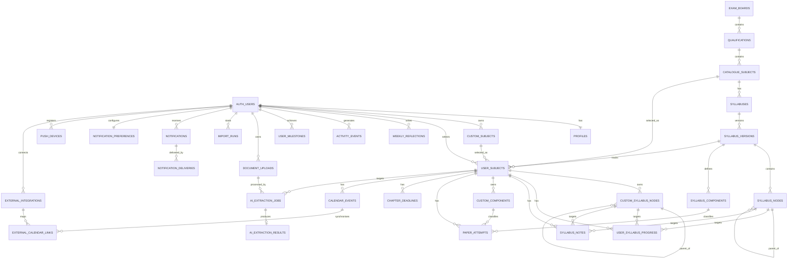

# Study Buddy Hub — Stage 3 Database ER Model and Field-Level Schema Draft 3 Reviewed

**Document status:** Draft 3 — field-level schema synchronised with reviewed SQL and RLS design; local Supabase validation pending  
**SDLC stage:** Stage 3 — Database Architecture  
**Parent plan:** `docs/STUDY_BUDDY_HUB_STAGE_3_ARCHITECTURE_PLAN_DRAFT_3.md`  
**Repository evidence:** `docs/STUDY_BUDDY_HUB_STAGE_3_REPOSITORY_ARCHITECTURE_AUDIT.md`  
**Target platform:** Supabase PostgreSQL with Supabase Auth and Row Level Security  
**Schema purpose:** Define the relational source of truth before SQL migrations are implemented

---

## 1. Purpose

This document defines the proposed Study Buddy Hub database architecture at field level.

It covers:

- shared academic catalogue data;
- private user-owned study data;
- syllabus progress and notes;
- separate shared and private exam-component tables;
- past-paper attempts;
- reflections, streak events and milestones;
- deadlines and internal calendar events;
- AI document extraction;
- legacy import and migration tracking;
- notifications and push delivery metadata;
- future external calendar integration;
- database constraints;
- indexes;
- versioning and soft deletion;
- preliminary Row Level Security ownership rules;
- phased migration order.

This is a schema specification, not a production migration file.

SQL migrations should be generated only after this schema and its remaining decision points are approved.

---

## 2. Approved Database Architecture Decisions

The following decisions are already approved:

1. Supabase PostgreSQL is the only authoritative production database.
2. Shared catalogue data is system-managed data available inside Study Buddy Hub under approved access policies; it is not unrestricted internet-public data.
3. The seven-active-subject limit applies only to each user's `user_subjects` rows, not to the number of catalogue subjects, syllabuses, syllabus versions, syllabus nodes or syllabus components stored by the system.
4. Supabase Auth owns authentication identities.
5. Private application records are protected with Row Level Security.
6. Shared catalogue records are separated from private user records.
7. Official components use `syllabus_components`.
8. User-created components use `custom_components`.
9. The frontend receives one unified `ExamComponent` domain model.
10. User-uploaded or AI-extracted syllabus content remains private by default.
11. Mutable offline-supported records use version numbers.
12. IndexedDB is an offline cache and queue, not an authoritative database.
13. Existing `localStorage` data is migrated through a controlled, recoverable process.
14. AI provider, push-provider and integration secrets remain server-side.
15. Database changes are tracked through version-controlled migrations.
16. Advanced Google Calendar integration remains outside the first cloud milestone.

---

## 3. Schema Organisation

### 3.1 `public` schema

In PostgreSQL and Supabase, `public` is a schema name. It does **not** mean that the contained data is automatically accessible to everyone on the internet.

Access remains controlled by:

- authentication;
- table privileges;
- Row Level Security;
- trusted backend functions.

The `public` schema contains records that the authenticated client may read or mutate under RLS:

- shared catalogue tables;
- profiles;
- user subjects;
- custom syllabus data;
- progress and notes;
- custom components;
- paper attempts;
- reflections;
- activity summaries;
- milestones;
- deadlines;
- calendar events;
- user preferences;
- document-upload metadata;
- AI job and review state;
- import-run status;
- notifications;
- notification preferences.

### 3.2 `private` schema

The `private` schema contains backend-only operational data:

- AI usage and cost ledger;
- notification delivery attempts;
- FCM device tokens;
- external integration credentials/metadata;
- external calendar link records;
- security-sensitive operational audit records.

These tables must not be exposed directly through the client Data API.

### 3.3 Supabase-managed schemas

- `auth` remains owned by Supabase Auth.
- `storage` remains owned by Supabase Storage.
- Application tables reference `auth.users(id)` but do not modify Auth-owned tables directly.

---

## 4. Naming and Data Conventions

### 4.1 Naming

- table and column names use `snake_case`;
- primary keys use `id`;
- ownership uses `user_id`;
- timestamps use `_at`;
- boolean fields use `is_`, `has_` or `_enabled`;
- foreign keys use `<entity>_id`.

### 4.2 Primary keys

Application records use:

```sql
uuid primary key default gen_random_uuid()
```

The exception is a one-to-one table where `user_id` is the natural primary key.

### 4.3 Time

- timestamps use `timestamptz`;
- database values are stored in UTC;
- date-only academic values use `date`;
- the user's display timezone is stored in preferences.

### 4.4 Status values

Evolving workflow statuses should normally use `text` with `CHECK` constraints instead of PostgreSQL enums.

This makes later additions easier while preserving validation.

### 4.5 Versioning

Offline-supported mutable records use:

```text
version bigint NOT NULL DEFAULT 1
```

Successful mutations increment the version atomically.

### 4.6 Soft deletion

Records requiring cross-device delete propagation use:

```text
deleted_at timestamptz NULL
```

Active queries exclude deleted records unless recovery or reconciliation requires them.

### 4.7 Ownership integrity

Private child tables include `user_id`.

Where practical, composite foreign keys enforce that a child and parent belong to the same user:

```text
(user_subject_id, user_id)
→ user_subjects(id, user_id)
```

This complements RLS and prevents cross-user relationships at database level.

---

## 5. High-Level Entity Relationship Diagram



---

# PART A — SHARED ACADEMIC CATALOGUE

## 6. `public.exam_boards`

Stores examination organisations such as Cambridge International.

| Column | Type | Null | Default | Rules |
|---|---|---:|---|---|
| `id` | `uuid` | No | `gen_random_uuid()` | Primary key |
| `code` | `text` | No | — | Unique, uppercase canonical code |
| `name` | `text` | No | — | Length 2–120 |
| `website_label` | `text` | Yes | — | Display-only label |
| `is_active` | `boolean` | No | `true` | — |
| `created_at` | `timestamptz` | No | `now()` | — |
| `updated_at` | `timestamptz` | No | `now()` | Updated automatically |

### Constraints

- unique `code`;
- `char_length(code)` between 2 and 20;
- `char_length(name)` between 2 and 120.

### Initial access

- authenticated users: `SELECT` active records;
- service/admin role: catalogue writes.

---

## 7. `public.qualifications`

Stores qualification families such as Cambridge International A Level.

| Column | Type | Null | Default | Rules |
|---|---|---:|---|---|
| `id` | `uuid` | No | `gen_random_uuid()` | Primary key |
| `exam_board_id` | `uuid` | No | — | FK to `exam_boards` |
| `code` | `text` | No | — | Board-specific code |
| `name` | `text` | No | — | Qualification name |
| `level_label` | `text` | No | — | Example: `A Level` |
| `is_active` | `boolean` | No | `true` | — |
| `created_at` | `timestamptz` | No | `now()` | — |
| `updated_at` | `timestamptz` | No | `now()` | — |

### Constraints

- unique `(exam_board_id, code)`;
- non-empty `name` and `level_label`.

### Indexes

- index `exam_board_id`;
- partial index on active qualifications.

---

## 8. `public.catalogue_subjects`

Stores official shared subject definitions.

| Column | Type | Null | Default | Rules |
|---|---|---:|---|---|
| `id` | `uuid` | No | `gen_random_uuid()` | Primary key |
| `qualification_id` | `uuid` | No | — | FK to `qualifications` |
| `code` | `text` | No | — | Example: `9709` |
| `slug` | `text` | No | — | URL-safe |
| `name` | `text` | No | — | Example: `Mathematics` |
| `description` | `text` | Yes | — | Shared description |
| `is_active` | `boolean` | No | `true` | — |
| `created_at` | `timestamptz` | No | `now()` | — |
| `updated_at` | `timestamptz` | No | `now()` | — |

### Constraints

- unique `(qualification_id, code)`;
- unique `(qualification_id, slug)`;
- slug check: lowercase letters, numbers and hyphens;
- name length 2–120.

### Indexes

- index `qualification_id`;
- index `(is_active, name)`.

---

## 9. `public.syllabuses`

Represents a continuing syllabus family for a catalogue subject.

| Column | Type | Null | Default | Rules |
|---|---|---:|---|---|
| `id` | `uuid` | No | `gen_random_uuid()` | Primary key |
| `catalogue_subject_id` | `uuid` | No | — | FK to `catalogue_subjects` |
| `syllabus_code` | `text` | No | — | Usually subject code |
| `title` | `text` | No | — | Display title |
| `is_active` | `boolean` | No | `true` | — |
| `created_at` | `timestamptz` | No | `now()` | — |
| `updated_at` | `timestamptz` | No | `now()` | — |

### Constraints

- unique `(catalogue_subject_id, syllabus_code)`.

---

## 10. `public.syllabus_versions`

Stores dated/versioned syllabus specifications.

| Column | Type | Null | Default | Rules |
|---|---|---:|---|---|
| `id` | `uuid` | No | `gen_random_uuid()` | Primary key |
| `syllabus_id` | `uuid` | No | — | FK to `syllabuses` |
| `version_label` | `text` | No | — | Example: `2026–2027` |
| `valid_from_year` | `smallint` | No | — | 1900–9999 |
| `valid_to_year` | `smallint` | No | — | 1900–9999 and must be >= start |
| `status` | `text` | No | `'draft'` | `draft`, `active`, `retired` |
| `source_reference` | `text` | Yes | — | Non-secret source identifier |
| `source_sha256` | `text` | Yes | — | 64 lowercase hex characters |
| `published_at` | `timestamptz` | Yes | — | Set when activated |
| `created_at` | `timestamptz` | No | `now()` | — |
| `updated_at` | `timestamptz` | No | `now()` | — |

### Constraints

- unique `(syllabus_id, version_label)`;
- `valid_from_year BETWEEN 1900 AND 9999`;
- `valid_to_year BETWEEN valid_from_year AND 9999`;
- status check;
- SHA-256 format check when present.

### Indexes

- `(syllabus_id, status)`;
- `(valid_from_year, valid_to_year)`;
- partial index for `status = 'active'`.

---

## 11. `public.syllabus_nodes`

Stores the official shared syllabus hierarchy.

| Column | Type | Null | Default | Rules |
|---|---|---:|---|---|
| `id` | `uuid` | No | `gen_random_uuid()` | Primary key |
| `syllabus_version_id` | `uuid` | No | — | FK to `syllabus_versions` |
| `parent_id` | `uuid` | Yes | — | Self-FK |
| `node_type` | `text` | No | — | `section`, `topic`, `subtopic`, `learning_outcome` |
| `node_code` | `text` | Yes | — | Example: `1.2` |
| `title` | `text` | No | — | Main display text |
| `description` | `text` | Yes | — | Optional detail |
| `sort_order` | `integer` | No | `0` | Non-negative |
| `source_key` | `text` | Yes | — | Stable import/catalogue reference |
| `is_active` | `boolean` | No | `true` | — |
| `created_at` | `timestamptz` | No | `now()` | — |
| `updated_at` | `timestamptz` | No | `now()` | — |

### Constraints

- node type check;
- non-negative `sort_order`;
- non-empty title;
- parent and child must belong to the same syllabus version, enforced by trigger;
- root nodes have `parent_id IS NULL`.

### Indexes

- `(syllabus_version_id, parent_id, sort_order)`;
- `(syllabus_version_id, node_type)`;
- partial unique `(syllabus_version_id, source_key)` when `source_key IS NOT NULL`;
- index `parent_id`.

---

## 12. `public.syllabus_components`

Stores official shared exam components for a syllabus version.

| Column | Type | Null | Default | Rules |
|---|---|---:|---|---|
| `id` | `uuid` | No | `gen_random_uuid()` | Primary key |
| `syllabus_version_id` | `uuid` | No | — | FK to `syllabus_versions` |
| `name` | `text` | No | — | Component name |
| `paper_code` | `text` | Yes | — | Example: `9709/32` |
| `duration_minutes` | `smallint` | Yes | — | Positive |
| `total_marks` | `numeric(8,2)` | Yes | — | Positive |
| `weighting_percent` | `numeric(5,2)` | Yes | — | 0–100 |
| `display_order` | `smallint` | No | `0` | Non-negative |
| `is_active` | `boolean` | No | `true` | — |
| `created_at` | `timestamptz` | No | `now()` | — |
| `updated_at` | `timestamptz` | No | `now()` | — |

### Constraints

- positive duration when present;
- positive marks when present;
- weighting range 0–100;
- non-negative display order;
- unique `(syllabus_version_id, paper_code)` when paper code exists.

### Indexes

- `(syllabus_version_id, display_order)`;
- partial index for active components.

---

# PART B — IDENTITY AND SUBJECT SELECTION

## 13. `public.profiles`

Stores application-level profile information linked one-to-one with Supabase Auth.

| Column | Type | Null | Default | Rules |
|---|---|---:|---|---|
| `user_id` | `uuid` | No | — | PK and FK to `auth.users(id)` |
| `username` | `text` | Yes | — | Null until onboarding; stored in normalised lowercase after protected claim |
| `display_name` | `text` | Yes | — | Optional |
| `onboarding_status` | `text` | No | `'not_started'` | `not_started`, `in_progress`, `completed` |
| `onboarding_completed_at` | `timestamptz` | Yes | — | — |
| `created_at` | `timestamptz` | No | `now()` | — |
| `updated_at` | `timestamptz` | No | `now()` | — |

### Constraints

- partial unique index on `lower(username)` where username is not null;
- username length proposed: 3–30;
- username character policy proposed: letters, numbers, underscore and period;
- reserved names rejected by protected backend;
- display name maximum 80 characters;
- onboarding status check.

### Security

- users may read their profile and update only permitted non-identity fields;
- username claim/change occurs only through `change_username()`;
- username lookup for login occurs only through a protected server function;
- no public username-to-email mapping is exposed.

---

## 14. `public.custom_subjects`

Stores subjects created privately by a user.

| Column | Type | Null | Default | Rules |
|---|---|---:|---|---|
| `id` | `uuid` | No | `gen_random_uuid()` | Primary key |
| `user_id` | `uuid` | No | — | FK to `auth.users` |
| `name` | `text` | No | — | 2–120 characters |
| `code` | `text` | Yes | — | User-provided |
| `qualification_label` | `text` | Yes | — | Optional |
| `description` | `text` | Yes | — | Optional |
| `created_at` | `timestamptz` | No | `now()` | — |
| `updated_at` | `timestamptz` | No | `now()` | — |
| `deleted_at` | `timestamptz` | Yes | — | Soft deletion |
| `version` | `bigint` | No | `1` | Incremented atomically |
| `client_operation_id` | `uuid` | Yes | — | Stable idempotency key for queued/retried create operations |

### Constraints

- unique `(id, user_id)` for composite ownership FKs;
- non-empty name.

### Indexes

- `(user_id, deleted_at)`;
- `(user_id, lower(name))`.

---

## 15. `public.user_subjects`

Represents the subjects actively selected by a user.

The maximum of seven applies only to active `user_subjects` rows for one user. It does not limit the number of records stored in:

- `catalogue_subjects`;
- `syllabuses`;
- `syllabus_versions`;
- `syllabus_nodes`;
- `syllabus_components`.

A row refers to either an official catalogue subject or a private custom subject.

| Column | Type | Null | Default | Rules |
|---|---|---:|---|---|
| `id` | `uuid` | No | `gen_random_uuid()` | Primary key |
| `user_id` | `uuid` | No | — | FK to `auth.users` |
| `catalogue_subject_id` | `uuid` | Yes | — | FK to `catalogue_subjects` |
| `custom_subject_id` | `uuid` | Yes | — | Composite ownership FK |
| `syllabus_version_id` | `uuid` | Yes | — | FK to `syllabus_versions` |
| `display_name_override` | `text` | Yes | — | Optional |
| `sort_order` | `smallint` | No | `0` | 0–99 |
| `is_archived` | `boolean` | No | `false` | — |
| `created_at` | `timestamptz` | No | `now()` | — |
| `updated_at` | `timestamptz` | No | `now()` | — |
| `deleted_at` | `timestamptz` | Yes | — | Soft deletion |
| `version` | `bigint` | No | `1` | Offline conflict version |
| `client_operation_id` | `uuid` | Yes | — | Stable idempotency key for queued/retried create operations |

### Constraints

- exactly one of `catalogue_subject_id` and `custom_subject_id` must be non-null;
- custom subject must belong to the same user;
- `syllabus_version_id` is allowed only for catalogue subjects;
- selected syllabus version must belong to selected catalogue subject;
- unique `(id, user_id)`;
- one active selection per user per catalogue subject;
- one active selection per user per custom subject;
- maximum seven non-archived, non-deleted subjects enforced through an atomic database function.

### Recommended creation path

The client should call a protected RPC such as:

```text
create_user_subject(...)
```

The function performs the seven-subject limit check and insert in one transaction.

### Indexes

- `(user_id, is_archived, sort_order)` where `deleted_at IS NULL`;
- partial unique `(user_id, catalogue_subject_id)` for active catalogue rows;
- partial unique `(user_id, custom_subject_id)` for active custom rows;
- index `syllabus_version_id`.

---

# PART C — SYLLABUS, PROGRESS AND NOTES

## 16. `public.custom_syllabus_nodes`

Stores private user-created, CSV-imported, legacy-imported or AI-extracted syllabus nodes.

| Column | Type | Null | Default | Rules |
|---|---|---:|---|---|
| `id` | `uuid` | No | `gen_random_uuid()` | Primary key |
| `user_id` | `uuid` | No | — | Owner |
| `user_subject_id` | `uuid` | No | — | Composite FK to `user_subjects` |
| `parent_id` | `uuid` | Yes | — | Self-FK within same subject/user |
| `node_type` | `text` | No | — | Same node types as shared nodes |
| `node_code` | `text` | Yes | — | Optional |
| `title` | `text` | No | — | — |
| `description` | `text` | Yes | — | — |
| `sort_order` | `integer` | No | `0` | Non-negative |
| `source_type` | `text` | No | `'manual'` | `manual`, `csv`, `pdf_ai`, `legacy` |
| `source_key` | `text` | Yes | — | Stable migration/import key |
| `created_at` | `timestamptz` | No | `now()` | — |
| `updated_at` | `timestamptz` | No | `now()` | — |
| `deleted_at` | `timestamptz` | Yes | — | Soft deletion |
| `version` | `bigint` | No | `1` | Offline conflict version |
| `client_operation_id` | `uuid` | Yes | — | Stable idempotency key for queued/retried create operations |

### Constraints

- unique `(id, user_id)`;
- parent belongs to same user and user subject;
- node-type and source-type checks;
- non-negative sort order;
- partial unique `(user_subject_id, source_key)` when source key exists.

### Indexes

- `(user_subject_id, parent_id, sort_order)` where not deleted;
- `(user_id, updated_at)`;
- `(user_subject_id, node_type)`.

---

## 17. `public.user_syllabus_progress`

Stores confidence/progress state for either a shared or private syllabus node.

| Column | Type | Null | Default | Rules |
|---|---|---:|---|---|
| `id` | `uuid` | No | `gen_random_uuid()` | Primary key |
| `user_id` | `uuid` | No | — | Owner |
| `user_subject_id` | `uuid` | No | — | Composite ownership FK |
| `syllabus_node_id` | `uuid` | Yes | — | Shared target |
| `custom_syllabus_node_id` | `uuid` | Yes | — | Private target |
| `confidence_status` | `text` | Yes | — | `red`, `amber`, `green` |
| `last_reviewed_at` | `timestamptz` | Yes | — | — |
| `created_at` | `timestamptz` | No | `now()` | — |
| `updated_at` | `timestamptz` | No | `now()` | — |
| `deleted_at` | `timestamptz` | Yes | — | Tombstone |
| `version` | `bigint` | No | `1` | Offline conflict version |
| `client_operation_id` | `uuid` | Yes | — | Stable idempotency key for queued/retried create operations |

### Constraints

- exactly one target node is non-null;
- custom node belongs to same user and user subject;
- shared node belongs to the selected syllabus version;
- confidence status is null or one of `red`, `amber`, `green`;
- partial unique index per shared target;
- partial unique index per custom target.

### Indexes

- `(user_subject_id, confidence_status)` where not deleted;
- `(user_id, updated_at)`;
- partial unique `(user_subject_id, syllabus_node_id)` where shared target is present and not deleted;
- partial unique `(user_subject_id, custom_syllabus_node_id)` where custom target is present and not deleted.

---

## 18. `public.syllabus_notes`

Stores one current note per user-subject node.

| Column | Type | Null | Default | Rules |
|---|---|---:|---|---|
| `id` | `uuid` | No | `gen_random_uuid()` | Primary key |
| `user_id` | `uuid` | No | — | Owner |
| `user_subject_id` | `uuid` | No | — | Composite ownership FK |
| `syllabus_node_id` | `uuid` | Yes | — | Shared target |
| `custom_syllabus_node_id` | `uuid` | Yes | — | Private target |
| `content` | `text` | No | `''` | Maximum size set in implementation |
| `created_at` | `timestamptz` | No | `now()` | — |
| `updated_at` | `timestamptz` | No | `now()` | — |
| `deleted_at` | `timestamptz` | Yes | — | Tombstone |
| `version` | `bigint` | No | `1` | Offline conflict version |
| `client_operation_id` | `uuid` | Yes | — | Stable idempotency key for queued/retried create operations |

### Constraints

- exactly one target node;
- target ownership/version validation;
- partial unique indexes equivalent to progress;
- note length limit proposed: 20,000 characters.

### Indexes

- `(user_subject_id, updated_at)` where not deleted;
- partial unique target indexes.

---

# PART D — COMPONENTS, PAPERS AND ANALYTICS

## 19. `public.custom_components`

Stores private user-created exam components.

| Column | Type | Null | Default | Rules |
|---|---|---:|---|---|
| `id` | `uuid` | No | `gen_random_uuid()` | Primary key |
| `user_id` | `uuid` | No | — | Owner |
| `user_subject_id` | `uuid` | No | — | Composite ownership FK |
| `name` | `text` | No | — | — |
| `paper_code` | `text` | Yes | — | — |
| `duration_minutes` | `smallint` | Yes | — | Positive |
| `total_marks` | `numeric(8,2)` | Yes | — | Positive |
| `weighting_percent` | `numeric(5,2)` | Yes | — | 0–100 |
| `display_order` | `smallint` | No | `0` | Non-negative |
| `created_at` | `timestamptz` | No | `now()` | — |
| `updated_at` | `timestamptz` | No | `now()` | — |
| `deleted_at` | `timestamptz` | Yes | — | Tombstone |
| `version` | `bigint` | No | `1` | Offline version |
| `client_operation_id` | `uuid` | Yes | — | Stable idempotency key for queued/retried create operations |

### Constraints

- unique `(id, user_id)`;
- positive duration and marks;
- weighting 0–100;
- partial unique `(user_subject_id, paper_code)` when code exists and record active.

### Indexes

- `(user_subject_id, display_order)` where not deleted;
- `(user_id, updated_at)`.

---

## 20. Unified `ExamComponent` application model

The frontend repository merges:

- `syllabus_components`;
- `custom_components`.

The unified domain response contains:

| Field | Source |
|---|---|
| `id` | Source table ID |
| `source_type` | `catalogue` or `custom` |
| `user_subject_id` | Current user-subject context |
| `syllabus_version_id` | Shared source only |
| `name` | Both |
| `paper_code` | Both |
| `duration_minutes` | Both |
| `total_marks` | Both |
| `weighting_percent` | Both |
| `display_order` | Both |
| `created_at` | Both |
| `updated_at` | Both |

This may be implemented in repository code first.

A database view is optional and must use security-invoker behaviour if exposed.

---

## 21. `public.paper_attempts`

Stores past-paper and component-attempt records.

| Column | Type | Null | Default | Rules |
|---|---|---:|---|---|
| `id` | `uuid` | No | `gen_random_uuid()` | Primary key |
| `user_id` | `uuid` | No | — | Owner |
| `user_subject_id` | `uuid` | No | — | Composite ownership FK |
| `syllabus_component_id` | `uuid` | Yes | — | Shared component |
| `custom_component_id` | `uuid` | Yes | — | Private component |
| `component_name_snapshot` | `text` | Yes | — | Historical label |
| `paper_code_snapshot` | `text` | Yes | — | Historical code |
| `paper_year` | `smallint` | Yes | — | 1900 through the current calendar year |
| `session` | `text` | Yes | — | `feb_mar`, `may_jun`, `oct_nov`, `other` |
| `variant` | `text` | Yes | — | Example: `2` or `32` |
| `attempt_date` | `date` | No | `current_date` | — |
| `score` | `numeric(8,2)` | No | — | >= 0 |
| `max_marks` | `numeric(8,2)` | No | — | > 0 |
| `percentage` | `numeric(6,2)` | Generated | — | Generated from score/max |
| `duration_minutes` | `smallint` | Yes | — | Positive |
| `notes` | `text` | Yes | — | — |
| `created_at` | `timestamptz` | No | `now()` | — |
| `updated_at` | `timestamptz` | No | `now()` | — |
| `deleted_at` | `timestamptz` | Yes | — | Tombstone |
| `version` | `bigint` | No | `1` | Offline version |
| `client_operation_id` | `uuid` | Yes | — | Stable idempotency key for queued/retried create operations |

### Constraints

- at most one component reference is non-null;
- custom component belongs to same user and user subject;
- shared component belongs to selected syllabus version;
- `score >= 0`;
- `max_marks > 0`;
- `score <= max_marks`;
- duration positive when present;
- paper year must be between 1900 and the current calendar year, enforced through a validated mutation or trigger;
- future-facing syllabus validity, exam, deadline and calendar dates remain valid where appropriate;
- session checks;
- notes length limit proposed: 20,000 characters.

### Indexes

- `(user_subject_id, attempt_date DESC)` where not deleted;
- `(user_subject_id, syllabus_component_id)` where not deleted;
- `(user_subject_id, custom_component_id)` where not deleted;
- `(user_id, updated_at)`;
- `(user_subject_id, paper_year, session)`.

### Analytics

Initial analytics remain derived from query results.

The generated percentage avoids repeated inconsistent calculations while retaining original score and maximum marks.

---

# PART E — REFLECTIONS, ACTIVITY AND PLANNING

## 22. `public.weekly_reflections`

| Column | Type | Null | Default | Rules |
|---|---|---:|---|---|
| `id` | `uuid` | No | `gen_random_uuid()` | Primary key |
| `user_id` | `uuid` | No | — | Owner |
| `week_start` | `date` | No | — | User's configured week start |
| `wins` | `text` | Yes | — | — |
| `challenges` | `text` | Yes | — | — |
| `next_steps` | `text` | Yes | — | — |
| `rating` | `smallint` | Yes | — | Proposed 1–5 |
| `created_at` | `timestamptz` | No | `now()` | — |
| `updated_at` | `timestamptz` | No | `now()` | — |
| `deleted_at` | `timestamptz` | Yes | — | — |
| `version` | `bigint` | No | `1` | — |
| `client_operation_id` | `uuid` | Yes | — | Stable idempotency key for queued/retried create operations |

### Constraints

- partial unique `(user_id, week_start)` where active;
- rating between 1 and 5.

---

## 23. `public.activity_events`

Append-only event stream used for streaks and selected analytics.

| Column | Type | Null | Default | Rules |
|---|---|---:|---|---|
| `id` | `uuid` | No | `gen_random_uuid()` | Primary key |
| `user_id` | `uuid` | No | — | Owner |
| `event_type` | `text` | No | — | Controlled list |
| `entity_type` | `text` | Yes | — | — |
| `entity_id` | `uuid` | Yes | — | — |
| `source_operation_id` | `uuid` | Yes | — | Idempotency |
| `metadata` | `jsonb` | No | `'{}'` | Non-secret |
| `occurred_at` | `timestamptz` | No | `now()` | — |
| `created_at` | `timestamptz` | No | `now()` | — |

### Constraints

- unique `(user_id, source_operation_id)` when source ID exists;
- metadata must be a JSON object.

### Security

Clients should not be able to create arbitrary milestone/streak events.

Events are produced by:

- trusted database functions;
- validated mutations;
- backend functions.

---

## 24. `public.user_milestones`

| Column | Type | Null | Default | Rules |
|---|---|---:|---|---|
| `id` | `uuid` | No | `gen_random_uuid()` | Primary key |
| `user_id` | `uuid` | No | — | Owner |
| `milestone_code` | `text` | No | — | Stable identifier |
| `achieved_at` | `timestamptz` | No | `now()` | — |
| `acknowledged_at` | `timestamptz` | Yes | — | — |
| `metadata` | `jsonb` | No | `'{}'` | — |

### Constraints

- unique `(user_id, milestone_code)`;
- generated by trusted logic, not arbitrary client insert.

---

## 25. `public.chapter_deadlines`

Supports the current chapter-deadline foundation.

| Column | Type | Null | Default | Rules |
|---|---|---:|---|---|
| `id` | `uuid` | No | `gen_random_uuid()` | Primary key |
| `user_id` | `uuid` | No | — | Owner |
| `user_subject_id` | `uuid` | No | — | Composite ownership FK |
| `syllabus_node_id` | `uuid` | Yes | — | Shared target |
| `custom_syllabus_node_id` | `uuid` | Yes | — | Private target |
| `title_override` | `text` | Yes | — | — |
| `due_at` | `timestamptz` | No | — | — |
| `status` | `text` | No | `'planned'` | `planned`, `completed`, `dismissed` |
| `reminder_enabled` | `boolean` | No | `false` | Foundation only |
| `created_at` | `timestamptz` | No | `now()` | — |
| `updated_at` | `timestamptz` | No | `now()` | — |
| `deleted_at` | `timestamptz` | Yes | — | — |
| `version` | `bigint` | No | `1` | — |
| `client_operation_id` | `uuid` | Yes | — | Stable idempotency key for queued/retried create operations |

### Constraints

- exactly one target node;
- target belongs to the selected subject;
- status check.

### Indexes

- `(user_id, due_at)` where active and status is planned;
- `(user_subject_id, due_at)`.

---

## 26. `public.calendar_events`

Stores Study Buddy Hub's internal events independently of external calendars.

| Column | Type | Null | Default | Rules |
|---|---|---:|---|---|
| `id` | `uuid` | No | `gen_random_uuid()` | Primary key |
| `user_id` | `uuid` | No | — | Owner |
| `user_subject_id` | `uuid` | Yes | — | Optional |
| `event_type` | `text` | No | — | `exam`, `deadline`, `study`, `other` |
| `title` | `text` | No | — | — |
| `description` | `text` | Yes | — | — |
| `start_at` | `timestamptz` | No | — | — |
| `end_at` | `timestamptz` | Yes | — | Must be >= start |
| `is_all_day` | `boolean` | No | `false` | — |
| `timezone` | `text` | Yes | — | IANA timezone |
| `source_entity_type` | `text` | Yes | — | Optional internal link |
| `source_entity_id` | `uuid` | Yes | — | Optional |
| `created_at` | `timestamptz` | No | `now()` | — |
| `updated_at` | `timestamptz` | No | `now()` | — |
| `deleted_at` | `timestamptz` | Yes | — | — |
| `version` | `bigint` | No | `1` | — |
| `client_operation_id` | `uuid` | Yes | — | Stable idempotency key for queued/retried create operations |

### Constraints

- event-type check;
- end time not before start;
- optional `user_subject_id` uses a single-column foreign key with `ON DELETE SET NULL`;
- a validation trigger ensures a non-null subject belongs to the same user;
- deleting a subject detaches the event while preserving calendar history.

### Indexes

- `(user_id, start_at)` where not deleted;
- `(user_subject_id, start_at)`.

---

## 27. `public.user_preferences`

Stores account-level preferences that should follow the user across devices.

Device appearance settings may remain local unless the user explicitly enables synchronisation.

| Column | Type | Null | Default | Rules |
|---|---|---:|---|---|
| `user_id` | `uuid` | No | — | PK/FK to `auth.users` |
| `timezone` | `text` | No | `'UTC'` | IANA timezone |
| `locale` | `text` | No | `'en'` | BCP 47 style |
| `week_starts_on` | `smallint` | No | `1` | 0–6 |
| `sync_appearance_preferences` | `boolean` | No | `false` | — |
| `ai_processing_consent_at` | `timestamptz` | Yes | — | — |
| `created_at` | `timestamptz` | No | `now()` | — |
| `updated_at` | `timestamptz` | No | `now()` | — |

---

# PART F — DOCUMENTS, AI AND IMPORTS

## 28. `public.document_uploads`

Stores user-visible metadata for private Storage objects.

| Column | Type | Null | Default | Rules |
|---|---|---:|---|---|
| `id` | `uuid` | No | `gen_random_uuid()` | Primary key |
| `user_id` | `uuid` | No | — | Owner |
| `storage_bucket` | `text` | No | — | Approved private bucket |
| `storage_path` | `text` | No | — | User-scoped path |
| `original_filename` | `text` | No | — | Sanitised display name |
| `mime_type` | `text` | No | — | Approved PDF type |
| `size_bytes` | `bigint` | No | — | Positive |
| `sha256` | `text` | Yes | — | 64 hex |
| `status` | `text` | No | `'uploaded'` | `uploaded`, `processing`, `processed`, `failed`, `deleted` |
| `retention_until` | `timestamptz` | Yes | — | Policy-driven |
| `created_at` | `timestamptz` | No | `now()` | — |
| `deleted_at` | `timestamptz` | Yes | — | — |

### Constraints

- unique storage path;
- approved MIME type;
- positive file size;
- status and SHA format checks.

### Security

- actual object is stored in a private bucket;
- object paths must be user-scoped;
- upload and download use signed or authenticated access;
- retention rules are finalised before Phase 8.

---

## 29. `public.ai_extraction_jobs`

Stores user-visible AI processing state.

| Column | Type | Null | Default | Rules |
|---|---|---:|---|---|
| `id` | `uuid` | No | `gen_random_uuid()` | Primary key |
| `user_id` | `uuid` | No | — | Owner |
| `document_upload_id` | `uuid` | No | — | FK to owned document |
| `user_subject_id` | `uuid` | Yes | — | Optional target subject; detached with `ON DELETE SET NULL` while ownership is validated by trigger |
| `status` | `text` | No | `'queued'` | `queued`, `processing`, `review_required`, `completed`, `failed`, `cancelled` |
| `processing_strategy` | `text` | Yes | — | Benchmark-selected |
| `provider_name` | `text` | Yes | — | Recorded after selection |
| `model_name` | `text` | Yes | — | Recorded after selection |
| `attempt_count` | `smallint` | No | `0` | Non-negative |
| `error_code` | `text` | Yes | — | Sanitised |
| `error_message` | `text` | Yes | — | User-safe |
| `started_at` | `timestamptz` | Yes | — | — |
| `finished_at` | `timestamptz` | Yes | — | — |
| `created_at` | `timestamptz` | No | `now()` | — |
| `updated_at` | `timestamptz` | No | `now()` | — |

### Constraints

- document and subject belong to owner;
- status check;
- non-negative attempt count;
- only trusted functions can update provider, model and processing state.

### Indexes

- `(user_id, created_at DESC)`;
- `(status, created_at)` for backend job processing;
- index `document_upload_id`.

---

## 30. `public.ai_extraction_results`

Stores the structured result awaiting user review.

| Column | Type | Null | Default | Rules |
|---|---|---:|---|---|
| `id` | `uuid` | No | `gen_random_uuid()` | Primary key |
| `user_id` | `uuid` | No | — | Owner |
| `job_id` | `uuid` | No | — | Unique FK |
| `schema_version` | `text` | No | — | Result-contract version |
| `result_json` | `jsonb` | No | — | Validated structured result |
| `validation_status` | `text` | No | — | `valid`, `repaired`, `invalid` |
| `validation_errors` | `jsonb` | No | `'[]'` | Array |
| `review_status` | `text` | No | `'pending'` | `pending`, `approved`, `rejected` |
| `topic_count` | `integer` | No | `0` | Non-negative |
| `component_count` | `integer` | No | `0` | Non-negative |
| `approved_at` | `timestamptz` | Yes | — | — |
| `rejected_at` | `timestamptz` | Yes | — | — |
| `created_at` | `timestamptz` | No | `now()` | — |
| `updated_at` | `timestamptz` | No | `now()` | — |

### Constraints

- unique `job_id`;
- job belongs to same user;
- JSON result must be an object;
- errors must be an array;
- status checks.

### Security

- users may read and review their own result;
- only trusted extraction logic may create the result;
- approval invokes a transactional import function;
- approval does not publish to the shared catalogue.

---

## 31. `private.ai_usage_ledger`

Backend-only usage and cost ledger.

| Column | Type | Null | Default | Rules |
|---|---|---:|---|---|
| `id` | `uuid` | No | `gen_random_uuid()` | Primary key |
| `user_id` | `uuid` | No | — | Account charged |
| `job_id` | `uuid` | Yes | — | Related job |
| `provider_name` | `text` | No | — | — |
| `model_name` | `text` | No | — | — |
| `operation_type` | `text` | No | — | Extraction, repair, summary |
| `input_units` | `bigint` | Yes | — | Provider-specific |
| `output_units` | `bigint` | Yes | — | Provider-specific |
| `estimated_cost_usd` | `numeric(12,6)` | Yes | — | Non-negative |
| `chargeable_to_allowance` | `boolean` | No | `true` | False for provider failure |
| `provider_request_id` | `text` | Yes | — | Operational reference |
| `occurred_at` | `timestamptz` | No | `now()` | — |

### Indexes

- `(user_id, occurred_at DESC)`;
- `(provider_name, occurred_at)`;
- `(job_id)`.

---

## 32. `public.import_runs`

Tracks CSV, AI, JSON and legacy migration operations.

| Column | Type | Null | Default | Rules |
|---|---|---:|---|---|
| `id` | `uuid` | No | `gen_random_uuid()` | Primary key |
| `user_id` | `uuid` | No | — | Owner |
| `source_type` | `text` | No | — | `legacy_local`, `json`, `csv`, `ai` |
| `source_hash` | `text` | Yes | — | Idempotency |
| `status` | `text` | No | `'preview'` | `preview`, `confirmed`, `running`, `completed`, `partial`, `failed`, `cancelled` |
| `preview_summary` | `jsonb` | No | `'{}'` | Counts and warnings |
| `result_summary` | `jsonb` | No | `'{}'` | Final counts |
| `error_summary` | `jsonb` | No | `'[]'` | Sanitised errors |
| `started_at` | `timestamptz` | Yes | — | — |
| `completed_at` | `timestamptz` | Yes | — | — |
| `created_at` | `timestamptz` | No | `now()` | — |
| `updated_at` | `timestamptz` | No | `now()` | — |

### Constraints

- source/status checks;
- JSON-shape checks;
- partial unique `(user_id, source_type, source_hash)` where source hash exists and completed.

---

# PART G — NOTIFICATIONS AND INTEGRATIONS

## 33. `public.notifications`

Authoritative in-app notification records.

| Column | Type | Null | Default | Rules |
|---|---|---:|---|---|
| `id` | `uuid` | No | `gen_random_uuid()` | Primary key |
| `user_id` | `uuid` | No | — | Recipient |
| `category` | `text` | No | — | Controlled category |
| `title` | `text` | No | — | — |
| `body` | `text` | No | — | — |
| `payload` | `jsonb` | No | `'{}'` | Safe navigation metadata |
| `dedupe_key` | `text` | Yes | — | Prevent duplicates |
| `read_at` | `timestamptz` | Yes | — | User-controlled |
| `expires_at` | `timestamptz` | Yes | — | — |
| `created_at` | `timestamptz` | No | `now()` | — |

### Constraints

- payload must be an object;
- partial unique `(user_id, dedupe_key)` when provided.

### Security

- users can read own notifications;
- users can update `read_at` through controlled mutation;
- users cannot create arbitrary notification records;
- creation is performed by trusted functions.

---

## 34. `public.notification_preferences`

| Column | Type | Null | Default | Rules |
|---|---|---:|---|---|
| `user_id` | `uuid` | No | — | PK/FK |
| `push_enabled` | `boolean` | No | `false` | Requires permission/token |
| `email_enabled` | `boolean` | No | `false` | Non-security messages |
| `ai_job_updates` | `boolean` | No | `true` | — |
| `sync_conflicts` | `boolean` | No | `true` | — |
| `migration_updates` | `boolean` | No | `true` | — |
| `quiet_hours_start` | `time` | Yes | — | — |
| `quiet_hours_end` | `time` | Yes | — | — |
| `created_at` | `timestamptz` | No | `now()` | — |
| `updated_at` | `timestamptz` | No | `now()` | — |

Security/account emails are controlled separately and are not disabled by ordinary preference flags.

---

## 35. `private.notification_deliveries`

Backend-only delivery-attempt records.

| Column | Type | Null | Default | Rules |
|---|---|---:|---|---|
| `id` | `uuid` | No | `gen_random_uuid()` | Primary key |
| `notification_id` | `uuid` | No | — | FK |
| `user_id` | `uuid` | No | — | Recipient |
| `channel` | `text` | No | — | `push`, `email` |
| `status` | `text` | No | `'pending'` | `pending`, `sent`, `failed`, `skipped` |
| `attempt_count` | `smallint` | No | `0` | Non-negative |
| `provider_message_id` | `text` | Yes | — | — |
| `last_error_code` | `text` | Yes | — | Sanitised |
| `next_attempt_at` | `timestamptz` | Yes | — | — |
| `sent_at` | `timestamptz` | Yes | — | — |
| `created_at` | `timestamptz` | No | `now()` | — |
| `updated_at` | `timestamptz` | No | `now()` | — |

### Indexes

- `(status, next_attempt_at)`;
- `(notification_id, channel)`;
- `(user_id, created_at DESC)`.

---

## 36. `private.push_devices`

Stores FCM device tokens and revocation state.

| Column | Type | Null | Default | Rules |
|---|---|---:|---|---|
| `id` | `uuid` | No | `gen_random_uuid()` | Primary key |
| `user_id` | `uuid` | No | — | Owner |
| `token` | `text` | No | — | Sensitive FCM token |
| `token_hash` | `text` | No | — | Unique lookup |
| `platform` | `text` | Yes | — | Web |
| `browser_label` | `text` | Yes | — | Non-authoritative |
| `device_label` | `text` | Yes | — | User-facing |
| `is_active` | `boolean` | No | `true` | — |
| `last_seen_at` | `timestamptz` | No | `now()` | — |
| `revoked_at` | `timestamptz` | Yes | — | — |
| `created_at` | `timestamptz` | No | `now()` | — |
| `updated_at` | `timestamptz` | No | `now()` | — |

### Constraints

- unique `token_hash`;
- token registration and revocation occur through protected backend functions;
- token values are never returned in general client reads.

---

## 37. `private.external_integrations`

Future integration metadata.

| Column | Type | Null | Default | Rules |
|---|---|---:|---|---|
| `id` | `uuid` | No | `gen_random_uuid()` | Primary key |
| `user_id` | `uuid` | No | — | Owner |
| `provider` | `text` | No | — | Example: `google_calendar` |
| `status` | `text` | No | — | `connected`, `expired`, `revoked`, `error` |
| `external_account_id` | `text` | Yes | — | Provider identifier |
| `granted_scopes` | `text[]` | No | `'{}'` | Minimal scopes |
| `secret_reference` | `text` | Yes | — | Reference to secure token storage |
| `connected_at` | `timestamptz` | Yes | — | — |
| `expires_at` | `timestamptz` | Yes | — | — |
| `revoked_at` | `timestamptz` | Yes | — | — |
| `metadata` | `jsonb` | No | `'{}'` | Non-secret |
| `created_at` | `timestamptz` | No | `now()` | — |
| `updated_at` | `timestamptz` | No | `now()` | — |

### Constraints

- unique active provider connection per user where appropriate;
- raw provider tokens are not stored directly in client-accessible tables.

---

## 38. `private.external_calendar_links`

Future idempotent mapping between internal and external events.

| Column | Type | Null | Default | Rules |
|---|---|---:|---|---|
| `id` | `uuid` | No | `gen_random_uuid()` | Primary key |
| `user_id` | `uuid` | No | — | Owner |
| `integration_id` | `uuid` | No | — | FK |
| `calendar_event_id` | `uuid` | No | — | Internal event |
| `external_calendar_id` | `text` | Yes | — | Provider calendar |
| `external_event_id` | `text` | No | — | Provider event |
| `sync_status` | `text` | No | — | `synced`, `pending`, `conflict`, `error`, `deleted` |
| `last_synced_at` | `timestamptz` | Yes | — | — |
| `last_error_code` | `text` | Yes | — | — |
| `created_at` | `timestamptz` | No | `now()` | — |
| `updated_at` | `timestamptz` | No | `now()` | — |

### Constraints

- unique `(integration_id, calendar_event_id)`;
- unique `(integration_id, external_event_id)`.

---

# PART H — ROW LEVEL SECURITY OWNERSHIP SUMMARY

## 39. Preliminary RLS Matrix

| Table group | Authenticated user access | Trusted backend access |
|---|---|---|
| Shared catalogue | Read active approved rows | Full catalogue administration |
| `profiles` | Read/update own profile | Create/repair profile |
| `custom_subjects` | CRUD own | Migration/account deletion |
| `user_subjects` | CRUD own through validated path | Migration/admin support |
| Custom syllabus nodes | CRUD own | AI/import commit |
| Progress and notes | CRUD own | Migration/conflict repair |
| Custom components | CRUD own | Migration |
| Paper attempts | CRUD own | Migration |
| Reflections | CRUD own | Migration |
| Activity events | Read own; limited/no direct insert | Generate validated events |
| Milestones | Read/acknowledge own | Generate milestone |
| Deadlines/events | CRUD own | Notification scheduling |
| Preferences | Read/update own | Account setup |
| Document uploads | Read own metadata | Process/delete |
| AI jobs/results | Read own; review own result | Create/process/update |
| Import runs | Read own status | Execute import |
| Notifications | Read own; mark own as read | Create and dispatch |
| Notification preferences | Read/update own | Initialise defaults |
| Private operational tables | No direct Data API access | Backend only |

### Policy pattern

Private user-owned tables require:

- `SELECT USING (auth.uid() IS NOT NULL AND auth.uid() = user_id)`;
- `INSERT WITH CHECK (auth.uid() IS NOT NULL AND auth.uid() = user_id)`;
- `UPDATE USING (...) WITH CHECK (...)`;
- `DELETE USING (...)`.

Individual tables may restrict client inserts or deletes further.

---


## 39A. User-facing soft deletion

The following records expose version-aware protected tombstone functions:

- custom subject definitions that are no longer selected;
- custom syllabus nodes;
- syllabus progress;
- syllabus notes;
- custom components;
- paper attempts;
- weekly reflections;
- chapter deadlines;
- internal calendar events.

Deletion requires ownership and the current `base_version`. A stale delete returns a conflict rather than overwriting a newer change.

Deleting a custom syllabus node tombstones its complete private subtree and related progress, notes and chapter deadlines.

Deleting a custom component preserves historical paper attempts. Paper-attempt snapshot fields remain available after the component is no longer active.

## 39B. Create-operation idempotency

Offline/retried create operations use `client_operation_id`.

Protected create/upsert functions return an existing row when the operation ID has already completed. Direct-insert repositories must treat an operation-ID unique violation as a retry result and fetch the existing row rather than showing a duplicate error to the user.

## 39C. Document deletion

A document is deleted through a protected Edge Function rather than by directly deleting `storage.objects` metadata.

The function removes the underlying object through the Storage API and then tombstones or updates `document_uploads` metadata. The operation must be idempotent and safe to retry.

---

# PART I — FUNCTIONS, TRIGGERS AND DATABASE RULES

## 40. Required database functions or triggers

The schema will require reviewed functions/triggers for:

1. `updated_at` maintenance;
2. atomic version increment;
3. seven-subject limit enforcement;
4. selected syllabus-version validation;
5. shared/custom node target validation;
6. component target validation;
7. percentage generation or validation;
8. safe profile creation after Auth signup;
9. import idempotency;
10. approved AI-result commit;
11. activity-event generation;
12. notification deduplication;
13. account deletion orchestration;
14. soft-delete propagation where required;
15. version-aware soft-delete functions for all user-facing deletable records;
16. protected Storage-object and metadata deletion through an Edge Function;
17. repository handling for idempotent direct-insert retries.

### Security rule

Any `SECURITY DEFINER` function must:

- use a fixed safe `search_path`;
- validate the caller;
- expose the minimum required operation;
- never accept an arbitrary target user without authorization;
- be covered by automated permission tests.

---

# PART J — INDEX STRATEGY

## 41. Mandatory indexing rules

Indexes are required on:

- all foreign keys used in common queries;
- `user_id` on private tables;
- ownership columns used in RLS;
- active-record query predicates;
- `updated_at` for sync;
- job and delivery status;
- event/deadline dates;
- target-node relationships;
- component relationships;
- source hashes and idempotency keys.

### Composite ownership indexes

User-owned parent tables should include:

```text
UNIQUE (id, user_id)
```

This enables composite ownership foreign keys.

### Soft-delete partial indexes

Frequent active queries should use partial indexes such as:

```text
WHERE deleted_at IS NULL
```

### Index review

Index creation should be based on expected queries and later validated with query plans.

Avoid speculative duplicate indexes.

---

# PART K — LEGACY DATA MAPPING

## 42. Current storage to database mapping

| Legacy source | Database destination |
|---|---|
| `study-tracker-data.subjects` | `user_subjects` and possibly `custom_subjects` |
| syllabus bullets | catalogue-node mapping or `custom_syllabus_nodes` |
| bullet confidence | `user_syllabus_progress` |
| bullet comments | `syllabus_notes` |
| past papers | `paper_attempts` |
| `study-tracker-components` | `custom_components` |
| `study-tracker-subject-components` | shared component mapping or migration reference |
| chapter planning | `chapter_deadlines` |
| streak data | `activity_events` plus derived streak |
| milestones | `user_milestones` |
| reminder settings | `notification_preferences` |
| exam schedule | `calendar_events` |
| reflections | `weekly_reflections` |
| extraction changelog | `ai_extraction_jobs` or migration audit metadata |
| weighting | `user_preferences` or later subject preference table |
| theme/accessibility | device-local by default |
| sync queue | reconcile before migration; do not import as authoritative history |

---

# PART L — PHASED DATABASE DELIVERY

## 43. Schema implementation order

### Database Phase A — Foundation

- extensions required by approved SQL;
- update/version helper functions;
- `profiles`;
- shared catalogue foundations;
- initial RLS framework.

### Database Phase B — Subjects and syllabus

- `custom_subjects`;
- `user_subjects`;
- `syllabus_nodes`;
- `custom_syllabus_nodes`;
- progress;
- notes;
- subject-limit function.

### Database Phase C — Components and papers

- `syllabus_components`;
- `custom_components`;
- `paper_attempts`;
- component validation functions.

### Database Phase D — Offline-supporting metadata

- version checks;
- tombstones;
- sync-oriented indexes;
- atomic mutation RPCs where required.

### Database Phase E — Migration and portability

- `import_runs`;
- migration functions;
- recovery and idempotency support.

### Database Phase F — AI

- document metadata;
- AI jobs;
- extraction results;
- private usage ledger;
- Storage policies.

### Database Phase G — Notifications

- notification records;
- preferences;
- private deliveries;
- private push devices.

### Database Phase H — Beta support

- reflections;
- activity events;
- milestones;
- deadlines;
- calendar events;
- external integration tables only when needed.

---

# PART M — REVIEW DECISIONS

## 44. Recommended decisions for approval

### 44.1 Shared/private schemas

**Recommendation:** Approve `public` for client-facing RLS tables and `private` for backend-only operational tables.

### 44.2 Progress and notes target design

**Recommendation:** Approve two nullable foreign keys:

- `syllabus_node_id`;
- `custom_syllabus_node_id`;

with an exactly-one check and validation trigger.

This keeps real foreign-key integrity for both shared and private syllabus nodes.

### 44.3 User-subject ownership

**Recommendation:** Approve composite foreign keys using `(id, user_id)` for private parent/child relationships.

This strengthens database ownership beyond RLS alone.

### 44.4 Seven-subject rule

**Recommendation:** Enforce the limit in an atomic database function rather than only in the frontend.

### 44.5 Component snapshots in paper attempts

**Recommendation:** Store component name/code snapshots on each paper attempt.

This preserves historical meaning when component definitions change later.

### 44.6 Activity and milestones

**Recommendation:** Prevent arbitrary client creation of activity and milestone records.

Generate them through validated mutations, database functions or protected backend operations.

### 44.7 AI and notification operational tables

**Recommendation:** Keep usage ledgers, delivery attempts, FCM tokens and integration secrets in the `private` schema.

---

## 45. Decision Resolution and Deliberate Deferrals

### 45.1 Unified component database view

**Decision:** A unified database view is **not required for Web v1**.

The application will initially combine:

- `syllabus_components`;
- `custom_components`;

inside the repository/service layer and expose one unified `ExamComponent` domain model to the frontend.

Reasons:

- the shared and private tables have different ownership and RLS rules;
- repository-level merging is easier to test and reason about;
- a database view would add security and maintenance complexity before it provides clear value;
- preserving source type is straightforward in application code.

A security-invoker database view may be introduced later only if repeated server-side reporting, analytics or query duplication demonstrates a measurable benefit.

### 45.2 Supabase Realtime

**Decision:** Supabase Realtime is **not justified for Web v1 by default**.

Initial cross-device consistency will use:

- TanStack Query invalidation;
- refetch after mutations;
- refetch on reconnect;
- refetch on window focus where appropriate;
- version-based conflict detection;
- explicit sync-state feedback.

Realtime may be evaluated later only for a proven requirement such as:

- collaborative study groups;
- live multi-device editing;
- instant server-to-client state updates that materially improve the user experience;
- operational dashboards that cannot be served adequately through ordinary refetching.

### 45.3 Decisions deliberately postponed

The following remain deliberately postponed until their approved technical evaluation phase:

- exact AI provider/model;
- exact AI document-processing strategy;
- exact transactional email provider;
- exact monitoring provider;
- exact encrypted-export format;
- final PDF retention duration;
- final external-calendar scope.

These are not blockers for approving the database baseline.

---

## 46. Acceptance Criteria for This Database Draft — Approved

This draft is ready to advance when:

- [x] the entity boundaries are accepted;
- [x] the shared/private schema split is accepted;
- [x] the progress/note target model is accepted;
- [x] the composite ownership strategy is accepted;
- [x] the seven-subject enforcement strategy is accepted;
- [x] the paper-attempt snapshot strategy is accepted;
- [x] the preliminary RLS ownership rules are accepted;
- [x] missing required data fields have been reviewed at owner level; further engineering refinements remain possible;
- [x] the schema is consistent with Stage 2 requirements;
- [x] the schema is consistent with the verified repository audit.

After approval, the next outputs are:

1. a migration-ready SQL schema draft;
2. a full RLS policy matrix;
3. an index and constraints checklist;
4. generated TypeScript domain/database type mapping;
5. local-development and seed-data plan.

---

## 47. Current Status and Next Deliverables

This schema direction is approved and synchronised with SQL Draft 3 and RLS Matrix Draft 3 as the field-level database baseline.

The next database deliverables are:

1. migration-ready SQL schema draft;
2. complete RLS policy matrix;
3. constraints and index verification checklist;
4. generated TypeScript database/domain type mapping;
5. local-development, migration and seed-data plan.

The SQL draft remains reviewable architecture output. It must not be applied to production until the relevant migrations, RLS policies and test cases have been reviewed.

